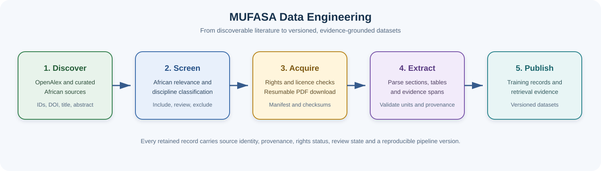

# Data Engineering

This layer discovers scientific work, classifies African relevance, records provenance and rights, and prepares validated inputs for model training and retrieval.

## Authoritative documents

- [Classification and download plan](./classification-and-download-plan.md)
- [African-relevance classification protocol](./african-relevance-classification-protocol.md)
- [African science taxonomy](./taxonomy/african-science-categories.md)
- [Source catalogues](./catalogs/)
- [Reviewed 200-paper public benchmark](./samples/classification-benchmark-200.parquet)

The large working directory is `data-extraction/`. It is intentionally excluded from Git because it contains credentials, raw OpenAlex exports, partitions and generated classification results.
