# MUFASA Model Training Pipeline

This document defines a robust path from discovering African scientific literature to producing an evaluated, preference-aligned, offline MUFASA model. The pipeline treats papers as evidence, not merely text: every important scientific claim should remain traceable to its source, conditions, measurements, and limitations.

The diagram is intentionally comprehensive, while the notes below it explain the decisions without overcrowding the visual.

## Rendered Preview

The SVG below is generated from the Mermaid source in this document. It remains visible in Markdown viewers that do not support Mermaid directly.

[Open the full-size pipeline diagram](./images/model-training-pipeline.svg)



## Editable Mermaid Source

```mermaid
flowchart TB
    classDef title fill:#FFFFFF,stroke:#FFFFFF,color:#0D315A,font-size:22px,font-weight:bold;
    classDef source fill:#E8F5E9,stroke:#2E7D32,color:#123B18,stroke-width:1.3px;
    classDef process fill:#E3F2FD,stroke:#1565C0,color:#0D315A,stroke-width:1.3px;
    classDef artifact fill:#FFF8E1,stroke:#F9A825,color:#5D4500,stroke-width:1.3px;
    classDef gate fill:#FCE4EC,stroke:#C2185B,color:#651036,stroke-width:1.3px;
    classDef train fill:#EDE7F6,stroke:#6A1B9A,color:#34104D,stroke-width:1.3px;
    classDef eval fill:#E0F7FA,stroke:#00838F,color:#00464D,stroke-width:1.3px;
    classDef deploy fill:#F3E5F5,stroke:#7B1FA2,color:#3C0F4F,stroke-width:1.3px;
    classDef reject fill:#F5F5F5,stroke:#757575,color:#333,stroke-dasharray:5 5;

    TITLE["MUFASA Model Training Pipeline"]:::title

    SCOPE["<b>0 - Scope and Governance</b><br/>African evidence-first domains, countries and languages<br/>Scientific taxonomy, rights, consent and safety"]:::process

    SOURCES["<b>1 - Discover and Acquire Sources</b><br/>Articles, preprints, theses, dissertations and proceedings<br/>Technical reports, OER, datasets, patents and partner archives<br/><i>AfricArXiv, repositories, AJOL, OpenAlex, Crossref and CORE</i>"]:::source

    RIGHTS{"Licence and ethics approved<br/>for this exact full text?"}:::gate
    HOLD["Metadata only or quarantine"]:::reject

    INGEST["<b>2 - Data Engineering</b><br/>Native XML/HTML, GROBID PDF parsing and OCR for scans<br/>Recover tables, equations and citations; normalize units<br/>Link versions, deduplicate and retain source spans"]:::process

    SPLIT["<b>3 - Freeze Leakage-Safe Splits</b><br/>Group paper families, thesis versions and near duplicates<br/>Train, development, held-out test and challenge set"]:::gate

    KNOWLEDGE["<b>4 - Build Scientific Knowledge</b><br/>Extract methods, variables, conditions, results and limitations<br/>Create claim ledger plus evidence-linked knowledge graph<br/>Validate numbers, units, citations and high-risk claims"]:::artifact

    DATASETS["<b>5 - Create Model Datasets</b><br/>Optional CPT corpus, evidence bundles and reasoning SFT JSONL<br/>Teacher generation, automatic checks and expert review<br/>Frozen benchmark for grounding, reasoning, calibration and safety"]:::process

    BENCHMODEL["<b>6A - Base Model Benchmarking</b><br/>Qwen3-4B Thinking and Qwen3-8B Thinking<br/>Gemma 3 4B and Phi-4 Mini Reasoning<br/>Intel DeepMath v1<br/>Compare science quality, grounding, speed, memory and licence"]:::eval

    BASE["<b>6B - Select and Adapt the Base Model</b><br/>Choose the strongest model that meets deployment constraints<br/>Optional BF16 continued pretraining for a proven knowledge gap<br/>Reasoning SFT with BF16 LoRA by default"]:::train

    SFTGATE{"SFT improves facts, grounding<br/>and reasoning without regressions?"}:::eval

    PREFS["<b>7 - Build Scientific Preferences</b><br/>Failure-focused prompts produce 4-8 candidate answers<br/>Expert rubric creates prompt, chosen and hard-rejected pairs<br/>Check evidence, calculations, local fit, uncertainty and safety"]:::artifact

    DPO["<b>8 - Reinforcement Learning (DPO)</b><br/>Direct Preference Optimization from the approved SFT model<br/>Tune beta; monitor KL and preference margins<br/>Blind Base vs SFT vs DPO evaluation"]:::train

    DPOGATE{"DPO improves preferences<br/>without factual regression?"}:::eval

    QUANT{"<b>9 - Deployment Decision</b><br/>Is BF16 already small and fast enough?"}:::gate
    KEEP["Keep BF16/FP16<br/>for maximum fidelity"]:::deploy
    COMPRESS["Test INT8 or 4-bit<br/>AWQ, GPTQ or GGUF<br/>against the BF16 benchmark"]:::deploy

    RELEASE["<b>10 - Offline Release and Improvement</b><br/>Validated runtime, tokenizer, prompt template and checksums<br/>Model/data cards, evidence interface and corrections<br/>New approved literature feeds the next version"]:::deploy

    TITLE --> SCOPE --> SOURCES --> RIGHTS
    RIGHTS -- "Yes" --> INGEST
    RIGHTS -- "No / unclear" --> HOLD
    INGEST --> SPLIT --> KNOWLEDGE --> DATASETS --> BENCHMODEL --> BASE --> SFTGATE
    SFTGATE -- "Pass" --> PREFS --> DPO --> DPOGATE
    SFTGATE -- "Repair data or training" --> DATASETS
    DPOGATE -- "Pass" --> QUANT
    DPOGATE -- "Repair preference pairs" --> PREFS
    QUANT -- "Yes" --> KEEP --> RELEASE
    QUANT -- "No" --> COMPRESS --> RELEASE
    RELEASE -. "New evidence and failures" .-> SOURCES
```



## How to Read the Pipeline

- **Green** nodes are source families.
- **Blue** nodes transform documents or generate data.
- **Yellow** nodes are durable, versioned artifacts.
- **Pink** diamonds are legal, quality, or scientific gates.
- **Purple** nodes are model-training and deployment operations.
- **Cyan** nodes evaluate whether a model is allowed to advance.
- Dashed arrows are feedback or remediation loops, not the main production path.

## Stage-by-Stage Design Notes

### 0. Scope Before Scale

MUFASA should not acquire everything that merely has an African author or affiliation. Inclusion should answer at least one of these questions:

1. Does the work study an African material, organism, environment, population, industrial system, or scientific problem?
2. Was the experiment performed under conditions materially relevant to an African setting?
3. Does it document a locally developed method, process, dataset, or innovation?
4. Does it provide globally useful science that is necessary to reason correctly about one of the above?

The fourth condition allows essential background science without letting globally abundant literature drown out African evidence.

### 1. Source Strategy

Use aggregators primarily for **discovery and metadata**, then retrieve full text only from a lawful copy whose rights are recorded. Useful acquisition channels include:

| Source family | Examples | What MUFASA gains |
|---|---|---|
| African repositories | AfricArXiv; university DSpace/EPrints repositories; national research portals | Preprints, theses, dissertations, technical reports, locally important work with limited international visibility |
| Journal and conference platforms | African journals; open proceedings; society publications | Peer-reviewed experiments, reviews, methods, and regional comparisons |
| Scholarly indexes | OpenAlex, Crossref, CORE | Discovery, DOI and licence metadata, affiliation/citation trails, and—in permitted cases—open full text |
| Public institutions | Ministries, geological surveys, health/agriculture/energy agencies, standards and regulatory bodies | Applied evidence, surveys, specifications, local constraints, and operational data |
| Research institutes and universities | Laboratory reports, working papers, extension manuals, field trials | Practical knowledge and negative or inconclusive results often missing from journals |
| Open educational resources | Open textbooks, courseware, laboratory manuals | Scientific foundations, definitions, worked examples, and pedagogical explanations |
| Research data | Open datasets, codebooks, data dictionaries, supplementary files | Numerical grounding, units, geographic context, and reproducible calculations |
| Direct partnerships | Author deposits, university agreements, digitization projects | Explicit permission, better metadata, missing appendices, and human expertise |

“Available online” is not the same as “approved for training.” The rights ledger must record the licence and permitted use for each exact version. Restricted, embargoed, personally sensitive, sacred, or consent-limited material stays outside training unless the responsible rights holder explicitly approves its use.

### 2. Document Engineering

A PDF text dump is not an adequate scientific corpus. MUFASA needs section structure, table cells, captions, units, equations, citations, and page-level traceability. A parser such as GROBID can turn scientific PDFs into structured TEI XML; OCR is a separate fallback for scanned theses and older reports.

Every normalized statement should still map back to its original document location. For example:

```json
{
  "document_id": "mufasa:sha256:...",
  "section": "Results > Compressive strength",
  "page": 8,
  "source_span": "The 10% RHA mix achieved 31.2 MPa at 28 days...",
  "table_id": "table_4",
  "parser_confidence": 0.96,
  "rights_id": "rights:..."
}
```

Deduplication must work above the file level. A thesis, conference paper, preprint, and journal article may describe the same experiment. They should be linked as one research family so they do not become four independent votes in evidence synthesis or leak across dataset splits.

### 3. Structured Scientific Evidence and the Knowledge Graph

The graph is an intermediate reasoning asset, not the text directly fed to the language model. Each graph assertion should be backed by an evidence record rather than stored as an unqualified fact.

Example extracted observation:

```json
{
  "subject": "rice husk ash",
  "relation": "used_as_partial_replacement_for",
  "object": "ordinary Portland cement",
  "conditions": {
    "replacement_percent": 10,
    "curing_days": 28,
    "location": "Nigeria"
  },
  "outcome": {
    "property": "compressive strength",
    "value": 31.2,
    "unit": "MPa"
  },
  "evidence_span_id": "doc1024:p8:table4:r3",
  "study_limitations": ["single cement brand", "no long-term durability test"],
  "review_status": "human_verified"
}
```

This design lets MUFASA distinguish:

- a reported observation from a general scientific conclusion;
- correlation from causation;
- one study from a replicated finding;
- “optimal in this experiment” from “universally optimal”;
- absence of evidence from evidence of absence.

### 4. Dataset Products

The pipeline produces four different datasets. They should remain separately versioned.

| Dataset | Shape | Purpose |
|---|---|---|
| Continued-pretraining corpus | Clean document text with document boundaries and provenance | Adapt scientific language and domain knowledge when baseline testing shows it is necessary |
| SFT reasoning dataset | `messages` plus non-training metadata | Teach evidence comparison, calculations, limitations, local recommendations, citation, and abstention |
| Preference dataset | `prompt`, `chosen`, `rejected`, evidence IDs, rubric scores | Teach the model to prefer scientifically defensible answers through DPO |
| Frozen benchmark | Questions, evidence where applicable, scoring rubric, gold answers and metadata | Measure real progress without training contamination |

Example SFT record:

```json
{
  "messages": [
    {
      "role": "system",
      "content": "You are MUFASA. Use the supplied African scientific evidence, state uncertainty, and do not invent citations."
    },
    {
      "role": "user",
      "content": "Three Nigerian studies report different optimal rice-husk-ash replacement levels. Explain the disagreement and recommend the next experiment.\n\n[EVIDENCE BUNDLE ...]"
    },
    {
      "role": "assistant",
      "content": "The reported optima are not directly comparable because the studies used different ash burning temperatures, curing periods, and cement grades... A controlled factorial experiment should hold cement grade constant while varying..."
    }
  ],
  "metadata": {
    "task_type": "cross_study_synthesis",
    "evidence_ids": ["claim:104", "claim:208", "claim:319"],
    "domains": ["materials science", "civil engineering"],
    "split": "train",
    "review_status": "expert_approved"
  }
}
```

The model receives the formatted conversation during SFT. The rich metadata remains available for filtering, auditing, sampling, and evaluation; it does not need to be flattened into the prompt.

### 5. Training Order

The recommended order is:

```text
Frozen MUFASA benchmark
    → benchmark all candidate base models under comparable settings
    → select the best quality-and-efficiency trade-off
    → optional continued pretraining only if baseline evidence supports it
    → reasoning SFT
    → scientific preference data creation
    → DPO
    → post-training quantization if deployment requires it
```

Continued pretraining and SFT solve different problems:

- **Continued pretraining** improves familiarity with domain language and knowledge through next-token prediction.
- **SFT** teaches the desired scientific task behavior and response structure.
- **DPO** teaches which of two plausible behaviors should be preferred.

#### Base-Model Benchmarking and Selection

No model should be declared the MUFASA base from reputation alone. Step 6A runs every candidate on the same frozen MUFASA benchmark before Step 6B selects the final checkpoint.

| Candidate | Exact checkpoint or family to test | Why it belongs in the benchmark |
|---|---|---|
| Qwen3-4B Thinking | `Qwen/Qwen3-4B-Thinking-2507` | Primary 4B reasoning candidate with a permissive licence and strong reasoning focus |
| Qwen3-8B Thinking | `Qwen/Qwen3-8B` in thinking mode | Tests whether the larger Qwen model provides enough quality gain to justify higher memory and latency |
| Gemma 3 4B | `google/gemma-3-4b-it` | Efficient 4B-class multilingual alternative with long-context and multimodal capabilities |
| Phi-4 Mini Reasoning | `microsoft/Phi-4-mini-reasoning` | Compact 3.8B/4B-class reasoning model designed around reasoning-dense mathematical data |
| Intel DeepMath v1 | `Intel/deepmath-v1` | A 4B Qwen3-derived mathematical reasoning agent trained with GRPO; useful for testing concise computation-oriented reasoning |

Intel DeepMath must be tested in two clearly labelled modes: model-only generation and its intended agent setup with a sandboxed Python executor. Its tool-assisted score must not be compared with tool-free models as though the conditions were identical.

The benchmark should measure:

- African scientific knowledge and contextual relevance;
- cross-paper synthesis, contradiction handling and evidence grounding;
- quantitative reasoning, calculations, units and scientific problem solving;
- uncertainty calibration, citation discipline and appropriate abstention;
- instruction following, language coverage and general-capability retention;
- inference latency, throughput, peak RAM/VRAM and output-token efficiency;
- licence compatibility, tokenizer/context suitability, training ecosystem and LoRA support;
- expected deployment performance on the competition's actual offline hardware.

Use identical prompts, evidence bundles, maximum output budgets and scoring rubrics. Record model-specific recommended decoding settings rather than forcing one decoding configuration on architectures for which it is inappropriate. The final choice should be made with a predeclared scorecard that balances scientific quality against the real memory and latency constraints.

`Qwen/Qwen3-4B-Thinking-2507` remains a strong starting hypothesis, but it must earn selection against all four alternatives. Architecture popularity is not evidence that it is the best MUFASA base.

### 6. Reinforcement Learning (DPO) Design

DPO should begin only after SFT is genuinely competent. Otherwise, preference optimization merely teaches preferences over weak answers.

A useful DPO pair is difficult but decisively rankable:

```json
{
  "prompt": [
    {
      "role": "user",
      "content": "Based on the supplied studies, what rice-husk-ash replacement level should be used in coastal housing?"
    }
  ],
  "chosen": [
    {
      "role": "assistant",
      "content": "The evidence supports testing 10% as the initial design point, not adopting it unconditionally. The coastal recommendation remains uncertain because only one study measured chloride exposure..."
    }
  ],
  "rejected": [
    {
      "role": "assistant",
      "content": "Use 10% rice-husk ash because the studies show that it is the optimal percentage for concrete."
    }
  ],
  "metadata": {
    "rejection_reasons": ["overgeneralization", "ignored exposure mismatch", "missing uncertainty"],
    "evidence_ids": ["claim:104", "claim:208"],
    "human_adjudicated": true
  }
}
```

The rejected answer should be plausible. Trivial nonsense teaches little. Preference construction must also guard against a common failure: judges preferring longer or more polished answers even when the shorter answer is more accurate.

For MUFASA, DPO is preferable to online reinforcement learning as the first alignment stage because scientific rewards are difficult to verify automatically. DPO uses offline chosen/rejected pairs and avoids training a separate reward model. More advanced online methods should wait until MUFASA has reliable programmatic checks or expert-validated rewards.

### 7. Quantization Decision

Quantization is **not automatically required for training** and should not happen before the master model is evaluated.

For a 4B model on a single H100, the recommended default is:

- use **BF16 LoRA** for SFT and DPO where it fits comfortably;
- retain a BF16 master checkpoint and its adapter lineage;
- use **QLoRA with NF4 4-bit base weights** only if longer context, larger batches, a larger base model, or DPO's extra reference-model memory makes BF16 impractical;
- create 8-bit and 4-bit deployment builds only after training;
- select the deployment format by measured quality, RAM/VRAM, latency, and challenge constraints.

The key distinction is:

| Technique | When | Why |
|---|---|---|
| BF16 training | CPT/SFT/DPO | Strong H100 support and a high-fidelity default |
| QLoRA/NF4 | During parameter-efficient training, only if memory is the constraint | Reduces the frozen base model's memory while training LoRA adapters |
| 8-bit deployment quantization | After DPO | Moderate compression with a conservative quality target |
| 4-bit AWQ/GPTQ/GGUF | After DPO | Small offline artifact and lower memory use, subject to benchmark acceptance |
| FP8 | Training or compatible GPU serving when the stack supports it | H100 acceleration; it is not the same deployment path as CPU-oriented 4-bit GGUF |

Do not say that a quantized build is “good enough” merely because it loads. It must pass the same scientific benchmark as BF16, including numerical problems, citation fidelity, uncertainty, and long-context evidence synthesis.

## Evaluation and Release Gates

MUFASA should report more than one aggregate accuracy number.

| Dimension | Example measurement |
|---|---|
| Scientific correctness | Expert-scored claim and conclusion accuracy |
| Evidence grounding | Citation precision/recall; source-span entailment; unsupported claim rate |
| Quantitative reasoning | Final answer accuracy plus unit, formula, and intermediate-value checks |
| Cross-study synthesis | Correctly identifies agreement, contradiction, and condition differences |
| African contextual fit | Uses locally relevant evidence and explicitly checks transfer assumptions |
| Calibration | Confidence aligns with evidence strength; abstains on unanswerable prompts |
| Safety | Avoids unsupported medical, structural, environmental, or industrial prescriptions |
| General capability retention | Base-model reasoning and instruction tests do not materially regress |
| Efficiency | Peak memory, model size, first-token latency, tokens/second, and energy where measurable |

Every release comparison should include at least:

1. untouched base model;
2. SFT checkpoint;
3. DPO checkpoint;
4. final quantized candidate;
5. ablations such as “without knowledge-graph evidence bundles” or “without human review” where feasible.

## Minimum Viable Hackathon Path vs Full Vision

### Hackathon-critical path

1. Narrow the first domain and taxonomy.
2. Acquire a smaller, high-quality, rights-cleared corpus.
3. Parse documents and preserve evidence spans.
4. Freeze leakage-safe splits and create the benchmark.
5. Build structured claims and a focused knowledge graph.
6. Generate, validate, and review high-value SFT examples.
7. Run BF16 LoRA SFT and evaluate against the untouched base.
8. Build a carefully adjudicated DPO subset and run one controlled DPO experiment.
9. Quantize only if the offline deployment target requires it.
10. Demonstrate answers with traceable African evidence and honest uncertainty.

### Full foundation-model path

Expand countries, languages, disciplines, repositories, human-review partnerships, continued-pretraining volume, preference coverage, and evaluation depth while preserving the same lineage and quality gates. Scale should widen the evidence base, not weaken provenance.

## Recommended Durable Artifacts

```text
MUFASA/
├── source_registry/          # repository and acquisition configuration
├── manifests/                # immutable acquisition and rights ledgers
├── raw/                      # original rights-cleared documents
├── parsed/                   # TEI/JATS/text, OCR, tables, figures, equations
├── structured/               # entities, observations, claims and evidence spans
├── knowledge_graph/          # versioned nodes, edges and ontology mappings
├── datasets/
│   ├── cpt/
│   ├── sft/
│   ├── preference_dpo/
│   └── benchmark/
├── configs/                  # parsing, generation, training and inference configs
├── evaluations/              # immutable run reports and human adjudication
├── models/                   # adapters, merged BF16 masters and quantized builds
└── cards/                    # dataset cards, model cards and limitations
```

This is a logical artifact layout, not a requirement to commit papers or model weights to Git. Large or restricted artifacts should live in controlled object storage; the repository should hold manifests, schemas, code, checksums, and reproducible configurations.

## Technical References

- [AfricArXiv](https://africarxiv.org/) describes its African research literature and data repositories; its submission categories include preprints, journal articles, theses, presentations, and reports.
- [OpenAlex documentation](https://developers.openalex.org/) describes its open scholarly catalog and connected entities, useful for discovery and citation/affiliation metadata.
- [Crossref REST API documentation](https://www.crossref.org/documentation/retrieve-metadata/rest-api/) documents DOI metadata including licences, updates, abstracts, funders, ORCID, and ROR identifiers.
- [CORE API](https://core.ac.uk/services/api) provides machine access to metadata and, where available, open-access full text aggregated from repositories and journals.
- [GROBID documentation](https://grobid.readthedocs.io/en/latest/TEI-encoding-of-results/) explains full-document extraction into structured TEI XML.
- [Qwen3-4B-Thinking-2507 model card](https://huggingface.co/Qwen/Qwen3-4B-Thinking-2507) documents the 4B reasoning checkpoint, Apache-2.0 licence, and long-context capabilities.
- [Qwen3-8B model card](https://huggingface.co/Qwen/Qwen3-8B) documents its switchable thinking mode, 8.2B parameter size, context support, and Apache-2.0 licence.
- [Gemma 3 4B model card](https://huggingface.co/google/gemma-3-4b-it) documents the instruction-tuned 4B checkpoint, multilingual and long-context capabilities, and Gemma usage licence.
- [Phi-4 Mini Reasoning model card](https://huggingface.co/microsoft/Phi-4-mini-reasoning) documents its 3.8B architecture, reasoning-focused training, context length, and MIT licence.
- [Intel DeepMath v1 model card](https://huggingface.co/Intel/deepmath-v1) documents the 4B Qwen3-derived model, GRPO training, Apache-2.0 licence, and sandboxed Python agent design.
- [TRL DPO Trainer documentation](https://huggingface.co/docs/trl/dpo_trainer) documents explicit conversational preference records with `prompt`, `chosen`, and `rejected` fields.
- [Direct Preference Optimization paper](https://arxiv.org/abs/2305.18290) introduces DPO as a simpler offline preference-optimization objective without a separately fitted reward model.
- [Hugging Face PEFT quantization guide](https://huggingface.co/docs/peft/main/developer_guides/quantization) documents 4-bit QLoRA/NF4 preparation and BF16 compute.
- [QLoRA paper](https://arxiv.org/abs/2305.14314) explains training LoRA adapters through a frozen 4-bit quantized base model.
- [NVIDIA Transformer Engine FP8 primer](https://docs.nvidia.com/deeplearning/transformer-engine-releases/release-2.4/user-guide/examples/fp8_primer.html) explains H100 FP8 formats and their training use.
