# The GraphRAG Retrieval Layer

**Layer 3 of 4.** MUFASA's evidence graph, how it is built off-device, and how it is queried on-device while the model answers.

> **All examples in this document are synthetic.** Paper identifiers like `P-1024` are placeholders. No real DOI appears here. Before anything reaches a report, a demo or a slide, it must come from a record you have verified against the actual source.

## Two planes, kept separate

Most of the confusion in an offline RAG system comes from mixing what happens on your machine with what happens on the judge's laptop. They are different programs, run at different times, with different constraints.

```text
BUILD PLANE — your machine, hours, internet allowed

  Papers → rights check → parse → observations → quality gate → retrieval package
                                                                      │
                                                                      ▼
RUNTIME PLANE — the laptop, milliseconds, no internet, 7 GB ceiling

  Question → retrieve → generate → validate → answer
```

The build plane may be slow, may use a frontier model, may download whatever it needs. The runtime plane may do none of those things. Every design decision below belongs to exactly one plane.

## Why this layer exists

MUFASA is a foundation model. After training it already knows African science and can reason about laterite and rice husk ash without opening a paper. The graph gives it what training cannot:

| MUFASA knows this from training | It has to look this up |
|---|---|
| How to reason about materials and evidence | The exact measured value |
| That rice husk ash is a pozzolan | Which paper said it, and on what page |
| How to compare studies and spot weak evidence | What one specific thesis found |
| How to suggest an experiment | Whether your corpus already contains one |

**Retrieval is additive, never load-bearing for basic competence.** The automated scoring runs your `.gguf` alone in LM Studio or Ollama, with no graph attached. So MUFASA must answer well with nothing, and better with evidence.

That said, the application is not decorative. The challenge requires a working on-device system with a load-bearing cross-disciplinary integration, and Gates 2 and 3 judge it directly. Both halves matter; they are judged differently.

## Why a graph, not just a vector search

A vector search finds text that *sounds like* the question. Ask "what local material can replace imported bentonite in drilling mud?" and it returns passages containing the word bentonite. The answer is not in any single passage. It is spread across:

- a paper reporting that bentonite provides viscosity in drilling mud
- another reporting that a particular Nigerian clay provides viscosity
- a third measuring that clay's performance at temperature

Nothing links them except the shared property. A graph stores that link.

```text
Bentonite ──viscosity──► Viscosity ◄──viscosity── Kaolin clay
                                   ◄──viscosity── Attapulgite
```

The same structure supports the questions that make MUFASA a collaborator rather than a search box: what can replace X, why do studies disagree, and which combinations your corpus has no evidence for.

## The data model

Scientific results must **not** be stored as bare edges like `IMPROVES`. A measurement needs a value, a unit, a baseline it was compared against, the conditions it held under, and how confident the extraction was. An edge cannot carry that honestly, and you cannot attach further relationships to an edge in a property graph.

So the measurement becomes a node. This is the single most important structural decision in the layer.

```text
StudyFamily ─REPORTS──────► Observation
                            Observation ─SUBJECT──────► Material
                            Observation ─OUTCOME──────► Property
                            Observation ─CONTEXT──────► Application
                            Observation ─SUPPORTED_BY─► EvidenceSpan ─IN_PAPER─► Paper
```

```cypher
CREATE NODE TABLE Observation(
    id                    STRING,
    text                  STRING,       -- one-sentence statement, used for search
    direction             STRING,       -- increases | decreases | no_effect | inconclusive
    value                 DOUBLE,
    unit                  STRING,       -- canonical SI
    baseline              STRING,       -- what it was compared against
    conditions            STRING,       -- JSON: replacement_pct, curing_days, grade...
    uncertainty           STRING,       -- sd, n, p where reported
    extraction_confidence DOUBLE,
    review_status         STRING,       -- auto | human_checked
    embedding             FLOAT[384],
    PRIMARY KEY (id));

CREATE NODE TABLE EvidenceSpan(
    id STRING, quote STRING, page INT64, section STRING, PRIMARY KEY (id));

CREATE NODE TABLE Paper(
    id STRING, title STRING, authors STRING, year INT64,
    journal STRING, doi STRING, rights STRING, PRIMARY KEY (id));

CREATE NODE TABLE StudyFamily(id STRING, label STRING, PRIMARY KEY (id));
CREATE NODE TABLE Material(name STRING, PRIMARY KEY (name));
CREATE NODE TABLE Property(name STRING, PRIMARY KEY (name));
CREATE NODE TABLE Application(name STRING, PRIMARY KEY (name));

CREATE REL TABLE REPORTS(FROM StudyFamily TO Observation);
CREATE REL TABLE SUBJECT(FROM Observation TO Material);
CREATE REL TABLE OUTCOME(FROM Observation TO Property);
CREATE REL TABLE CONTEXT(FROM Observation TO Application);
CREATE REL TABLE SUPPORTED_BY(FROM Observation TO EvidenceSpan);
CREATE REL TABLE IN_PAPER(FROM EvidenceSpan TO Paper);
```

Two rules keep it honest:

1. **Every Observation reaches a Paper through an EvidenceSpan.** Walking the graph therefore produces citations automatically.
2. **One experiment is one StudyFamily**, however many times it was published. Otherwise a thesis, a conference paper and a journal article look like three confirmations.

Grouping publications into families is genuinely hard. For Gate 1, do it **by hand** for 200 papers and record who checked it. Automatic family resolution is stretch work.

## No PDFs ship

A thousand PDFs is 1.5–2 GB. You do not need them at runtime, because the EvidenceSpan carries the sentence:

```text
quote:  "The 10% RHA mix achieved 31.2 MPa at 28 days."     (synthetic example)
paper:  P-1024
where:  page 8, table 4, Results
```

Clicking a citation shows exactly that. It is instant, whereas a PDF viewer on an i5 with no graphics card takes seconds. It also avoids redistributing papers you may not have the right to redistribute — which matters, since your rights ledger already tracks exactly that.

| Approach | Size, 200 papers |
|---|---|
| Ship the PDFs | ~300 MB |
| **Ship spans and citations** | **~2 MB** |

Keep the PDFs in your own storage. You need them to re-parse and to defend any number. They stay on the build plane.

## The database: LadybugDB

LadybugDB is an embedded property graph database — `pip install ladybug`, MIT licence, Cypher, and the database is a folder. It is the maintained community fork of Kùzu, which was archived in October 2025 after Apple acquired the team. Do not build on Kùzu.

It holds the graph, a full-text index and a disk-based HNSW vector index in one engine, so a vector hit **is** a graph node and you walk straight out from it. That removes the id-mapping work that a separate vector store forces on you.

### Prove it works offline before you build on it — one day, do it first

This is the highest-risk item in the layer, and it is cheap to de-risk.

Ladybug's full-text and vector features are **extensions, downloaded over the network** from `extension.ladybugdb.com` when you run `INSTALL`. On a judging machine with no internet, that fails. Documented versions also disagree across sources, and the default memory buffer can be large enough to threaten the 7 GB ceiling on its own.

Day-one checklist:

- [ ] Pin an exact version. Record the wheel's hash in the repo.
- [ ] `INSTALL fts; INSTALL vector;` once **with** internet, then locate the extension files on disk and commit them to your bundle.
- [ ] **Disable networking entirely**, delete the cache, restore the bundled extensions, and confirm `LOAD fts; LOAD vector;` still works.
- [ ] Cap the buffer pool explicitly. Do not accept the default.
- [ ] Measure whole-process RSS and query latency with the ADTC profiler on a real slice.

If any of that fails, you fall back to graph traversal plus a simple index, and you have lost a day rather than a submission.

| Alternative | Why not |
|---|---|
| Neo4j | Needs a server and a JVM. Too heavy for a 7 GB offline laptop |
| LanceDB + Kùzu | Two engines, two id spaces, and Kùzu is archived |
| NetworkX | A library in memory, not a database that ships |
| SQL tables as a graph | Fine for one hop, painful beyond it |

## Build plane: papers to package

Your current position matters. The data work has classified metadata; **PDFs have not been downloaded yet**. So the retrieval package does not fall out of existing work — acquisition, parsing and extraction are real tasks that must be scheduled.

```text
1. Choose ONE flagship domain          e.g. agricultural-waste materials in concrete
2. Select ~200 papers in that domain   from the classified metadata
3. Check rights for each               record the licence; exclude what you may not use
4. Download and parse                  GROBID, OCR where needed, recover tables
5. Extract Observations                frontier model + schema, with page and span kept
6. Normalise                           units to SI, names to canonical entities
7. Group StudyFamilies                 by hand, recorded
8. Quality gate                        sample and human-check; reject the batch if it fails
9. Load into Ladybug, build indexes    COPY FROM Parquet
10. Version and hash the package       corpus_v1, with a manifest
```

**200 well-parsed papers in one domain beats 6,000 badly parsed ones.** A demo that answers three questions perfectly in materials engineering is stronger than one that answers vaguely across six fields. The wider 6,000-paper corpus remains the *training* corpus for Layer 2; it does not all need to be in the graph for Gate 1.

Records move as Parquet, which Ladybug loads directly and which you already produce:

```cypher
COPY Observation FROM 'records/observations.parquet';
COPY Paper       FROM 'records/papers.parquet';
```

## Runtime plane: question to evidence

Keep this flow exact and predictable. No deep walks, no adaptive loops.

```text
Question
  → detect intent and entities        (rules + the alias list, no model)
  → BM25 and vector search in parallel
  → ONE-hop graph expansion from the hits
  → merge, deduplicate, rank
  → select 6–10 Observations
  → MUFASA generates
  → validate citations, numbers, units
  → answer
```

One hop is enough, and occasionally two. Deeper traversal drifts off topic and its cost is unpredictable — the opposite of what you want on a thermally limited laptop.

A valid local-search query:

```cypher
MATCH (m:Material {name: $material})<-[:SUBJECT]-(o:Observation)-[:OUTCOME]->(p:Property)
MATCH (sf:StudyFamily)-[:REPORTS]->(o)
MATCH (o)-[:SUPPORTED_BY]->(e:EvidenceSpan)-[:IN_PAPER]->(paper:Paper)
RETURN p.name AS property, o.direction, o.value, o.unit, o.conditions,
       count(DISTINCT sf) AS study_families,
       collect(DISTINCT {quote: e.quote, page: e.page, paper: paper.id})[..3] AS evidence
ORDER BY study_families DESC
```

### Sequence the retrieval channels

Start with **BM25 plus one-hop graph**. It needs no model, no vectors and no extension, and on a focused 200-paper corpus it is strong. Add dense vectors once you have measured what they add and what they cost in memory — they earn their place mainly on paraphrases and on questions asked in another language.

Build the fallback deliberately: **if the vector extension fails to load, BM25 and the graph still answer.** Log it, show a quiet notice, keep working. A retrieval layer with a single point of failure is not offline-ready.

### The alias list

*bitter leaf = onugbu = ewuro = Vernonia amygdalina*; *RHA = rice husk ash = rice hull ash*. A few hundred hand-written lines for one domain. Without it, an English-only search misses much of your corpus.

## Coverage, not novelty

The earlier draft of this document claimed a missing edge proves nobody has studied something. **That was wrong and it has been removed.**

A missing edge can mean the paper was never collected, the PDF was unavailable, extraction missed the claim, the wording was not normalised, or the work sits outside your 200. Absence in your graph is not absence in the literature — a distinction your own training pipeline already insists on.

So the system reports **corpus coverage**, and says so precisely:

> "No verified matching evidence in MUFASA corpus v1 — 214 papers, materials engineering, 2005–2024, Nigeria and Ghana. The nearest related evidence is [E3]."

```cypher
MATCH (m:Material {name: $material}), (p:Property {name: $property})
OPTIONAL MATCH (m)<-[:SUBJECT]-(o:Observation)-[:OUTCOME]->(p)
RETURN count(o) AS observations_in_corpus
```

This is honest, still useful, and defensible under questioning — which "nobody has studied this" is not.

## The disagreement matrix

The best low-cost feature in the layer, and a better headline than novelty claims.

Take the Observations that share a Material and a Property, and sort them into **supporting**, **conflicting** and **inconclusive** by their `direction` and value. Then show which `conditions` differ between the groups.

> Four observations, three agree. The outlier differs only in ash burning temperature — 600 °C against 800 °C.

That is a single query plus a grouping, it produces a table a real researcher wants, and it demonstrates that the graph is load-bearing rather than ornamental.

## What goes to the model

**6–10 Observations**, each tagged `[E1]`, `[E2]`, with value, units, conditions and the quoted span. Roughly 1,000–1,500 tokens.

Keep it short because prompt reading dominates latency on a CPU. Ten well-chosen records beat fifty average ones for accuracy *and* speed. Everything upstream — family grouping, condition alignment, ranking — exists so that ten is enough.

## Validation before display

- Every number in the answer must appear in the Observation it cites, after unit conversion.
- Every specific claim must carry a tag. General science is allowed and labelled; unsupported specifics are cut.
- An invented tag such as `[E9]` when eight were supplied fails immediately.
- On failure, retry that claim once, then soften the answer.

About fifty lines of code, and the strongest thing you can put in front of a judge.

## Measure the layer

Freeze **30–50 questions** across your flagship domain, including some you know the corpus cannot answer. Report:

| Metric | What it tells you |
|---|---|
| Recall@10 | Did the right evidence come back at all |
| Citation precision | Do cited spans support the sentences |
| Unsupported-claim rate | How often specifics arrive with no source |
| Out-of-corpus abstention | Does it correctly say "not in this corpus" |
| p95 latency | Retrieval time on the real laptop |
| Peak whole-system RSS | Measured, not estimated |

Run it after every meaningful change. Without this you cannot tell whether adding vectors, or one more hop, helped or hurt.

## Size and memory

**These are estimates to be replaced by measurements.** Ladybug's real footprint depends on its buffer pool setting, which you must cap and verify.

At the Gate 1 slice of ~200 papers and ~6,000 Observations:

| Part | Disk |
|---|---|
| Observation rows, of which embeddings are ~1.5 KB each | ~12 MB |
| Evidence spans and papers | ~2 MB |
| Vector and full-text indexes | ~6 MB |
| **Estimated package** | **~20–30 MB** |

At 1,000 papers expect roughly 100–150 MB; at the full 6,000, roughly 600–900 MB. The embedding is ~80% of every Observation row, so if size ever bites, shorten the vector or embed fewer nodes — never drop the spans, which are the cheapest and most valuable field.

Memory is the scarce resource, not disk. Budget the whole retrieval process at **under 400 MB** and confirm it with the profiler. Also cap thread use: graph queries running flat out while the model decodes will overheat the laptop, and thermal throttling costs 10 marks.

## Build order for Gate 1

Roughly three weeks, part time, alongside model training. Gate 1 closes **25 August 2026**.

| When | Step | Cut if short? |
|---|---|---|
| Day 1 | **Ladybug offline spike** — pin, bundle extensions, network off, cap memory, measure | **Never. Do this first** |
| Week 1 | Pick the flagship domain; select and rights-check ~200 papers; download and parse | **Never** |
| Week 1–2 | Extract Observations with spans and units; normalise names; group StudyFamilies by hand | **Never** |
| Week 2 | Load Ladybug, build indexes, BM25 + one-hop graph retrieval | **Never** |
| Week 2 | 6–10 record evidence bundle wired to the model | No |
| Week 2 | Citation and number validation | No — best value per line |
| Week 3 | Coverage reporting, corpus-scoped | No |
| Week 3 | Disagreement matrix | Keep — this is the standout |
| Week 3 | 30–50 question evaluation set, measured | Keep |
| Stretch | Dense vectors, alias list beyond one domain, second flagship domain | Yes |
| Not now | Community summaries, novelty claims, automatic family resolution, deep traversal, learned rerankers | Deferred |

## Diagram

```mermaid
flowchart TB
    classDef title fill:#FFFFFF,stroke:#FFFFFF,color:#0D315A,font-size:22px,font-weight:bold;
    classDef source fill:#E8F5E9,stroke:#2E7D32,color:#123B18,stroke-width:1.3px;
    classDef process fill:#E3F2FD,stroke:#1565C0,color:#0D315A,stroke-width:1.3px;
    classDef artifact fill:#FFF8E1,stroke:#F9A825,color:#5D4500,stroke-width:1.3px;
    classDef gate fill:#FCE4EC,stroke:#C2185B,color:#651036,stroke-width:1.3px;
    classDef train fill:#EDE7F6,stroke:#6A1B9A,color:#34104D,stroke-width:1.3px;
    classDef eval fill:#E0F7FA,stroke:#00838F,color:#00464D,stroke-width:1.3px;
    classDef deploy fill:#F3E5F5,stroke:#7B1FA2,color:#3C0F4F,stroke-width:1.3px;
    classDef reject fill:#F5F5F5,stroke:#757575,color:#333,stroke-dasharray:5 5;

    TITLE["MUFASA GraphRAG Retrieval Layer"]:::title

    RECORDS["<b>0 - Records from Layer 1</b><br/>One flagship domain, about 200 rights-cleared papers<br/>Parsed with GROBID and OCR, tables and page anchors kept<br/><i>Build plane - your machine, internet allowed</i>"]:::source

    BUILD["<b>1 - Build the knowledge graph</b><br/>Every measurement becomes an Observation node<br/>value, unit, baseline, conditions, uncertainty, review status<br/>Observation to Material, Property, EvidenceSpan, Paper<br/>One experiment is one StudyFamily, however often published"]:::artifact

    HELP["<b>2 - Add the helpers</b><br/>Alias list: onugbu, ewuro, bitter leaf, RHA<br/>Full-text index for exact terms<br/>Vectors for paraphrase and other languages"]:::artifact

    QGATE{"<b>3 - Quality gate</b><br/>Extraction sampled and human-checked?<br/>Units normalised, every span reaches a paper?"}:::gate

    REDO["Fix extraction<br/>or normalisation"]:::reject

    PACK["<b>4 - Ship the package</b><br/>Ladybug graph, full-text and vectors, quoted spans<br/>Ladybug extensions bundled - they download over the network<br/>Versioned, hashed and measured as corpus v1"]:::artifact

    QUESTION["<b>5 - Question from the user</b><br/><i>Runtime plane - the laptop, no internet, 7 GB ceiling</i>"]:::source

    ENTRY["<b>6 - Find the way in</b><br/>Intent and entities from rules and the alias list<br/>No model needed for this step"]:::process

    SEARCH["<b>7 - Retrieve</b><br/>Full-text and vector search in parallel<br/>then ONE hop through the graph<br/>If vectors fail to load, full-text and graph still answer"]:::process

    TIDY["<b>8 - Tidy the results</b><br/>One experiment counted once, not four times<br/>Group observations that share conditions<br/>Name the condition that differs when they disagree"]:::process

    COV{"<b>9 - Is there matching evidence<br/>in corpus v1?</b>"}:::gate

    NOEV["<b>9b - Report coverage, not novelty</b><br/>No verified matching evidence in corpus v1<br/>214 papers, this domain, these years<br/>Show the nearest related evidence"]:::artifact

    LIST["<b>10 - Short list for MUFASA</b><br/>6 to 10 Observations tagged E1, E2, E3<br/>Value, units, conditions and the quoted span<br/><i>Short on purpose - prompt reading dominates CPU latency</i>"]:::artifact

    MODEL["<b>11 - MUFASA writes the answer</b><br/>llama.cpp, 4-bit model file, short by default<br/>Cites the tags it was given"]:::train

    CHECK{"<b>12 - Validate before display</b><br/>Numbers, units and tags<br/>match their evidence?"}:::eval

    FIX["Retry that claim once,<br/>then soften the answer"]:::reject

    ANSWER["<b>13 - Answer</b><br/>Click a claim, read the quoted sentence and its page<br/>Coverage card: corpus v1, N papers, years, countries"]:::deploy

    TITLE --> RECORDS --> BUILD --> HELP --> QGATE
    QGATE -- "Pass" --> PACK
    QGATE -- "Fail" --> REDO
    REDO -.-> BUILD
    PACK --> ENTRY
    QUESTION --> ENTRY --> SEARCH --> TIDY --> COV
    COV -- "None" --> NOEV --> MODEL
    COV -- "Yes" --> LIST --> MODEL
    MODEL --> CHECK
    CHECK -- "Pass" --> ANSWER
    CHECK -- "Fail" --> FIX --> MODEL
    ANSWER -. "questions the corpus cannot answer show which papers to collect next" .-> RECORDS
```





## How to Read the Diagram

- **Green** nodes are inputs: the records from Layer 1, and the user's question.
- **Blue** nodes are ordinary work — searching, grouping, resolving names.
- **Yellow** nodes are durable, versioned things: the graph, the shipped package, the short list.
- **Pink** diamonds are gates that stop bad work moving forward.
- **Purple** is MUFASA itself doing the thinking.
- **Cyan** is validation — the check that stops made-up numbers reaching the screen.
- **Violet** is what the user finally sees.
- **Grey dashed** nodes are repair paths, not the main route.
- The dashed arrow at the bottom is the feedback loop: questions the corpus cannot answer tell you which papers to collect next.

Steps 0 to 4 are the **build plane** — your machine, hours, internet allowed. Steps 5 to 13 are the **runtime plane** — the laptop, milliseconds, no internet, 7 GB ceiling. Nothing below step 4 may assume a network, a frontier model, or spare memory.

Note what is absent, deliberately: no deep traversal, no community summaries, no novelty claims.
