# The GraphRAG Retrieval Layer

**Layer 3 of 4.** MUFASA's evidence graph, how it is built off-device, and how it is queried on-device while the model answers.

> **All examples in this document are synthetic.** Paper identifiers like `P-1024` are placeholders. No real DOI appears here. Before anything reaches a report, a demo or a slide, it must come from a record you have verified against the actual source.

## Two planes, kept separate

Most of the confusion in an offline RAG system comes from mixing what happens on your machine with what happens on the judge's laptop. They are different programs, run at different times, with different constraints.

```text
BUILD PLANE — your machine, hours, internet allowed

  Papers → rights check → parse → observations → quality gate → retrieval package
                                                                      │
                                                                      ▼
RUNTIME PLANE — the laptop, milliseconds, no internet, 7 GB ceiling

  Question → retrieve → generate → validate → answer
```

The build plane may be slow, may use a frontier model, may download whatever it needs. The runtime plane may do none of those things. Every design decision below belongs to exactly one plane.

## Why this layer exists

MUFASA is a foundation model. After training it already knows African science and can reason about laterite and rice husk ash without opening a paper. The graph gives it what training cannot:

| MUFASA knows this from training | It has to look this up |
|---|---|
| How to reason about materials and evidence | The exact measured value |
| That rice husk ash is a pozzolan | Which paper said it, and on what page |
| How to compare studies and spot weak evidence | What one specific thesis found |
| How to suggest an experiment | Whether your corpus already contains one |

**Retrieval is additive, never load-bearing for basic competence.** The automated scoring runs your `.gguf` alone in LM Studio or Ollama, with no graph attached. So MUFASA must answer well with nothing, and better with evidence.

That said, the application is not decorative. The challenge requires a working on-device system with a load-bearing cross-disciplinary integration, and Gates 2 and 3 judge it directly. Both halves matter; they are judged differently.

## Why a graph, not just a vector search

A vector search finds text that *sounds like* the question. Ask "what local material can replace imported bentonite in drilling mud?" and it returns passages containing the word bentonite. The answer is not in any single passage. It is spread across:

- a paper reporting that bentonite provides viscosity in drilling mud
- another reporting that a particular Nigerian clay provides viscosity
- a third measuring that clay's performance at temperature

Nothing links them except the shared property. A graph stores that link.

```text
Bentonite ──viscosity──► Viscosity ◄──viscosity── Kaolin clay
                                   ◄──viscosity── Attapulgite
```

The same structure supports the questions that make MUFASA a collaborator rather than a search box: what can replace X, why do studies disagree, and which combinations your corpus has no evidence for.

## The data model

Scientific results must **not** be stored as bare edges like `IMPROVES`. A measurement needs a value, a unit, a baseline it was compared against, the conditions it held under, and how confident the extraction was. An edge cannot carry that honestly, and you cannot attach further relationships to an edge in a property graph.

So the measurement becomes a node. This is the single most important structural decision in the layer.

```text
StudyFamily ─REPORTS──────► Observation
                            Observation ─SUBJECT──────► Material
                            Observation ─OUTCOME──────► Property
                            Observation ─CONTEXT──────► Application
                            Observation ─SUPPORTED_BY─► EvidenceSpan ─IN_PAPER─► Paper
```

```cypher
CREATE NODE TABLE Observation(
    id                    STRING,
    text                  STRING,       -- one-sentence statement, used for search
    direction             STRING,       -- increases | decreases | no_effect | inconclusive
    value                 DOUBLE,
    unit                  STRING,       -- canonical SI
    baseline              STRING,       -- what it was compared against
    conditions            STRING,       -- JSON: replacement_pct, curing_days, grade...
    uncertainty           STRING,       -- sd, n, p where reported
    extraction_confidence DOUBLE,
    review_status         STRING,       -- auto | human_checked
    embedding             FLOAT[384],
    PRIMARY KEY (id));

CREATE NODE TABLE EvidenceSpan(
    id STRING, quote STRING, page INT64, section STRING, PRIMARY KEY (id));

CREATE NODE TABLE Paper(
    id STRING, title STRING, authors STRING, year INT64,
    journal STRING, doi STRING, rights STRING, PRIMARY KEY (id));

CREATE NODE TABLE StudyFamily(id STRING, label STRING, PRIMARY KEY (id));
CREATE NODE TABLE Material(name STRING, PRIMARY KEY (name));
CREATE NODE TABLE Property(name STRING, PRIMARY KEY (name));
CREATE NODE TABLE Application(name STRING, PRIMARY KEY (name));

CREATE REL TABLE REPORTS(FROM StudyFamily TO Observation);
CREATE REL TABLE SUBJECT(FROM Observation TO Material);
CREATE REL TABLE OUTCOME(FROM Observation TO Property);
CREATE REL TABLE CONTEXT(FROM Observation TO Application);
CREATE REL TABLE SUPPORTED_BY(FROM Observation TO EvidenceSpan);
CREATE REL TABLE IN_PAPER(FROM EvidenceSpan TO Paper);
```

Two rules keep it honest:

1. **Every Observation reaches a Paper through an EvidenceSpan.** Walking the graph therefore produces citations automatically.
2. **One experiment is one StudyFamily**, however many times it was published. Otherwise a thesis, a conference paper and a journal article look like three confirmations.

Grouping publications into families is genuinely hard, and at 6,000 papers it cannot be done by hand. Resolve families **automatically** — block on title similarity, shared authors and overlapping values — and hand-check a sample, recording who checked it. When it is ambiguous, leave them separate: over-merging invents agreement, under-merging only costs a confirmation.

## No PDFs ship

Six thousand PDFs may occupy roughly 9 GB on disk. That is not 9 GB of RAM, but it is an unnecessary distribution and licensing burden. You do not need the PDFs at runtime, because the EvidenceSpan carries the sentence:

```text
quote:  "The 10% RHA mix achieved 31.2 MPa at 28 days."     (synthetic example)
paper:  P-1024
where:  page 8, table 4, Results
```

Clicking a citation shows exactly that. It is instant, whereas a PDF viewer on an i5 with no graphics card takes seconds. It also avoids redistributing papers you may not have the right to redistribute — which matters, since your rights ledger already tracks exactly that.

| Approach | Size, 6,000 papers |
|---|---|
| Ship the PDFs | ~9 GB — unnecessary runtime payload and redistribution risk |
| **Ship spans and citations** | **~60 MB** |

Keep the PDFs in your own storage. You need them to re-parse and to defend any number. They stay on the build plane.

## The database: LadybugDB

LadybugDB is an embedded property graph database distributed as the `ladybug` package. It uses Cypher and stores a current on-disk database as a local file. Install it only while building the release; the finished application must already contain Ladybug and everything it needs. It is the maintained community fork of Kùzu, which was archived in October 2025 after Apple acquired the team. Do not build on Kùzu.

It holds the graph, a full-text index and a disk-based HNSW vector index in one engine, so a vector hit **is** a graph node and you walk straight out from it. That removes the id-mapping work that a separate vector store forces on you.

### Offline packaging and startup contract

Ladybug works offline when it is packaged deliberately. The important distinction is simple:

| Command | What it does | MUFASA rule |
|---|---|---|
| `INSTALL fts` or `INSTALL vector` | Downloads an extension from Ladybug's server when it is not already cached | Build machine only; never run from the submitted application |
| `LOAD fts` or `LOAD vector` | Looks for an extension in Ladybug's user cache | Do not rely on this implicit cache on another machine |
| `LOAD EXTENSION '/absolute/path/libfts.lbug_extension'` | Opens the specified local binary | Use this form at runtime, with a path resolved from the installed application directory |

The runtime package must therefore contain all of the following, without needing `pip`, an installer or a network request:

- the pinned Ladybug runtime and the backend's Python dependencies inside the packaged backend executable or Tauri sidecar
- Linux x86-64 builds of `libfts.lbug_extension` and `libvector.lbug_extension`
- the query-embedding model, the `.lbdb` graph file and the application code
- `MANIFEST.sha256`, the exact Ladybug package version, extension compatibility version, database storage-format version, target platform and required licence notices

Do not infer the extension compatibility version from the Ladybug package number. They can differ: Ladybug `0.18.2`, for example, uses extension version `0.18.1`. Obtain the files from the exact pinned runtime on an Ubuntu 22.04 x86-64 build machine, then record and verify their hashes. Build the graph with that same pinned runtime. A Windows extension binary is not a substitute for a Linux binary. Pin the FTS index to the default `simple` tokenizer; using Jieba would also require its dictionary files in the package.

For every new Ladybug `Database` instance, normally once per backend start:

1. Resolve the package root and verify the two native-extension hashes plus the pinned runtime, extension and storage-format versions **before loading native code**. Verify all larger assets during release testing; repeat at startup only if the measured delay is acceptable.
2. Open the shipped graph with `read_only=True` and an explicit buffer-pool limit. Start with `256 * 1024 * 1024` bytes and change it only after measurement. Before packaging, checkpoint and close the build database cleanly; do not ship stale lock or write-ahead-log files.
3. Resolve the packaged extension paths from the application directory; do not hard-code `/opt/mufasa` or depend on the user's home directory.
4. Load both local files explicitly:

   ```cypher
   LOAD EXTENSION '/resolved/package/path/extensions/libfts.lbug_extension';
   LOAD EXTENSION '/resolved/package/path/extensions/libvector.lbug_extension';
   CALL SHOW_LOADED_EXTENSIONS() RETURN *;
   ```

5. Confirm that the reported extension names and paths match the package, then perform one real full-text query and one real vector query. Listing the extensions alone is not enough, and an explicitly loaded file may be reported with source `USER` rather than `OFFICIAL`.
6. Report each unavailable channel clearly and continue with the channels that passed. A vector failure leaves BM25 plus graph traversal; an FTS failure leaves vector plus graph traversal. If both search extensions are unavailable, graph lookup is possible only when rules or aliases resolve a known entity or ID. Otherwise return a clear **no retrieved evidence** state; do not pretend an arbitrary natural-language question was searched.

`LOAD` is session-scoped: copying an extension beside the database does not permanently enable it. Loading must be part of each `Database` instance's normal startup, not a one-time setup action. Runtime source must contain no path that executes `INSTALL`, including first-run helpers and exception handlers. A build-only packaging script may use `INSTALL` while internet access is available.

Ladybug's default buffer-pool ceiling is about 80% of physical RAM. That is a maximum rather than an immediate allocation, but it is still unsuitable beside the model under a 7 GB whole-system limit. Always pass the explicit byte limit to the Ladybug database constructor. Measure the Tauri app, backend, `llama.cpp` and Ladybug together, along with system available memory. **Peak RSS is the scored number** — the challenge records "maximum RSS measured during audit" — so budget and report against process-tree RSS, the pessimistic reading. Keep PSS beside it as a diagnostic only: it divides shared pages between processes instead of counting them in full in each, which makes it better for finding where memory actually goes but always lower than what the audit will record. Tuning against PSS means discovering the gap on the judging laptop.

Before accepting the Ladybug package, test the **exact distributable backend executable or Tauri sidecar**, not a development environment, on clean Ubuntu 22.04 x86-64 with networking disabled, an isolated empty home directory and no Ladybug cache. Launch it twice to prove startup loading is repeatable, verify the manifest, exercise both search channels, then test at roughly **180,000 vectors**, the scale implied by 6,000 papers. This clean test is the release gate; creating only a fresh database is insufficient because extensions can survive in a separate user cache.

Implementation references: [Ladybug extensions](https://docs.ladybugdb.com/extensions/), [on-disk files](https://docs.ladybugdb.com/developer-guide/files/), [the v0.18.2 extension version](https://github.com/LadybugDB/ladybug/blob/v0.18.2/CMakeLists.txt), and [the buffer-pool implementation](https://github.com/LadybugDB/ladybug/blob/v0.18.2/src/main/database.cpp).

Day-one acceptance checklist:

- [ ] Pin and record the Ladybug package, extension compatibility, storage format, Python/runtime and Ubuntu x86-64 target.
- [ ] Build the complete offline package and record hashes and licence notices.
- [ ] Build, checkpoint and close the graph with the pinned runtime; package it without stale lock or write-ahead-log files.
- [ ] Confirm startup verifies native binaries, opens the graph read-only, uses explicit packaged paths and repeats both `LOAD EXTENSION` commands for every new `Database` instance.
- [ ] Confirm no judge-facing runtime path executes `INSTALL`, `pip install` or a downloader.
- [ ] Pass the exact packaged application's clean, network-disabled, empty-home test twice, including real BM25 and vector queries.
- [ ] Enforce the explicit buffer-pool limit and measure process-tree and system memory plus latency at the target graph size.

Complete this small packaging test before building the full graph so the remaining retrieval work rests on a proven runtime.

| Alternative | Verdict |
|---|---|
| Neo4j | No — needs a server and a JVM. Too heavy for a 7 GB offline laptop |
| LanceDB + Kùzu | No — two engines, two id spaces, and Kùzu is archived |
| NetworkX | No — a library in memory, not a database that ships |
| SQL tables as a graph | Fine for one hop, painful beyond it — which is exactly the fallback below |
| **Ryu** (`predictable-labs/ryugraph`) | **Check this before committing.** Kùzu forked four ways, not one, and Ryu advertises full-text and vector search *built in*, with no external dependencies. If that holds, most of the packaging contract above simply disappears. Same Cypher and same lineage, so the migration cost is near zero |
| Bighorn (Kineviz), Vela fork | Same Kùzu lineage. Drop-in fallbacks if Ladybug stalls, but no advantage over it |
| **SQLite + FTS5** | **The named fallback.** FTS5 is compiled into SQLite itself — no extension binary, no network, it cannot fail to load. One hop is a join, and one hop is all this design needs. Costs vector search: sqlite-vec was still 0.1.7-alpha in February 2026, too green to submit |

If step 6 above ever reports both search channels unavailable on the judging laptop, SQLite plus FTS5 is the recovery path: BM25 and one-hop traversal over the same Observation rows, with the spans and citations intact. Losing paraphrase matching is survivable; shipping a graph nobody can search is not.

## Build plane: papers to package

Your current position matters. The data work has classified metadata; **PDFs have not been downloaded yet**. So the retrieval package does not fall out of existing work — acquisition, parsing and extraction are real tasks that must be scheduled.

```text
1. Take the full selected corpus       6,000 papers, 300 per field across 20 fields
2. Check rights for each               record the licence; exclude what you may not use
3. Download and parse                  GROBID, OCR where needed, recover tables
4. Extract Observations                frontier model + schema, with page and span kept
5. Normalise                           units to SI, names to canonical entities
6. Group StudyFamilies                 automatic blocking, sample human-checked
7. Quality gate                        sample and human-check per field; reject failing batches
8. Load into Ladybug, build indexes    COPY FROM Parquet
9. Version and hash the package        corpus_v1, with a manifest
10. Pick a flagship domain             for the evaluation set and the alias list
```

**The graph is the whole 6,000-paper corpus — the same corpus Layer 2 trains on.** One corpus, two products from one parsing job, and a question can cross from materials into agriculture and still land on evidence.

The cost is that extraction quality must now hold across 6,000 papers and 20 fields, and **that is the biggest risk in the layer**: a badly parsed graph is worse than a small one, because it looks complete while returning wrong numbers. So the quality gate is per field — sample and human-check each field, and drop a field rather than ship it thin. You still pick one **flagship domain**, but it is now where you go deep: the alias list, the evaluation questions and the demo all focus there.

Records move as Parquet, which Ladybug loads directly and which you already produce:

```cypher
COPY Observation FROM 'records/observations.parquet';
COPY Paper       FROM 'records/papers.parquet';
```

## Runtime plane: question to evidence

Keep this flow exact and predictable. No deep walks, no adaptive loops.

```text
Question
  → detect intent and entities        (rules + the alias list, no model)
  → BM25 and vector search in parallel
  → ONE-hop graph expansion from the hits
  → merge, deduplicate, rank
  → select 6–10 Observations
  → MUFASA generates
  → validate citations, numbers, units
  → answer
```

One hop is enough, and occasionally two. Deeper traversal drifts off topic and its cost is unpredictable — the opposite of what you want on a thermally limited laptop.

A valid local-search query:

```cypher
MATCH (m:Material {name: $material})<-[:SUBJECT]-(o:Observation)-[:OUTCOME]->(p:Property)
MATCH (sf:StudyFamily)-[:REPORTS]->(o)
MATCH (o)-[:SUPPORTED_BY]->(e:EvidenceSpan)-[:IN_PAPER]->(paper:Paper)
RETURN p.name AS property, o.direction, o.value, o.unit, o.conditions,
       count(DISTINCT sf) AS study_families,
       collect(DISTINCT {quote: e.quote, page: e.page, paper: paper.id})[..3] AS evidence
ORDER BY study_families DESC
```

### Sequence the retrieval channels

Start with **BM25 plus one-hop graph**. It needs no embedding model or vector index, but BM25 **does require the bundled `fts` extension**. It is the first search channel to get working. Across 6,000 papers and 20 fields it will not carry you alone, so add dense vectors as soon as BM25 is measured — they earn their place on paraphrases, on questions asked in another language, and on anything crossing between fields. Filter by field before the graph hop when the question clearly sits in one.

Treat the search channels independently. If `vector` is unavailable, BM25 and the graph still answer. If `fts` is unavailable, vector search and the graph still answer. If neither extension is available, use graph lookup only for a known entity or ID resolved by the rules or alias list; otherwise return no retrieved evidence. Surface the degraded status quietly at startup so it does not first appear halfway through a user's question.

### The alias list

*bitter leaf = onugbu = ewuro = Vernonia amygdalina*; *RHA = rice husk ash = rice hull ash*. A few hundred hand-written lines for the flagship domain. Without it, an English-only search misses much of your corpus.

## Coverage, not novelty

The earlier draft of this document claimed a missing edge proves nobody has studied something. **That was wrong and it has been removed.**

A missing edge can mean the paper was never collected, the PDF was unavailable, extraction missed the claim, the wording was not normalised, or the work sits outside your 6,000. A bigger corpus makes it more tempting to read absence as novelty, but 6,000 is still a capped selection from 155,825 candidates. Absence in your graph is not absence in the literature — a distinction your own training pipeline already insists on.

So the system reports **corpus coverage**, and says so precisely:

> "No verified matching evidence in MUFASA corpus v1 — 6,000 papers, 20 fields, 2005–2024, Africa-relevant. The nearest related evidence is [E3]."

State the count actually loaded, not the 6,000 target: rights exclusions and parse failures will put it lower.

```cypher
MATCH (m:Material {name: $material}), (p:Property {name: $property})
OPTIONAL MATCH (m)<-[:SUBJECT]-(o:Observation)-[:OUTCOME]->(p)
RETURN count(o) AS observations_in_corpus
```

This is honest, still useful, and defensible under questioning — which "nobody has studied this" is not.

## The disagreement matrix

The best low-cost feature in the layer, and a better headline than novelty claims.

Take the Observations that share a Material and a Property, and sort them into **supporting**, **conflicting** and **inconclusive** by their `direction` and value. Then show which `conditions` differ between the groups.

> Four observations, three agree. The outlier differs only in ash burning temperature — 600 °C against 800 °C.

That is a single query plus a grouping, it produces a table a real researcher wants, and it demonstrates that the graph is load-bearing rather than ornamental.

## What goes to the model

**6–10 Observations**, each tagged `[E1]`, `[E2]`, with value, units, conditions and the quoted span. Roughly 1,000–1,500 tokens.

Keep it short because prompt reading dominates latency on a CPU. Ten well-chosen records beat fifty average ones for accuracy *and* speed. Everything upstream — family grouping, condition alignment, ranking — exists so that ten is enough.

## Validation before display

- Every number in the answer must appear in the Observation it cites, after unit conversion.
- Every specific claim must carry a tag. General science is allowed and labelled; unsupported specifics are cut.
- An invented tag such as `[E9]` when eight were supplied fails immediately.
- On failure, retry that claim once, then soften the answer.

About fifty lines of code, and the strongest thing you can put in front of a judge.

## Measure the layer

Freeze **30–50 questions**, the bulk in your flagship domain, a few in other fields now that the graph covers them, and some you know the corpus cannot answer. Report:

| Metric | What it tells you |
|---|---|
| Recall@10 | Did the right evidence come back at all |
| Citation precision | Do cited spans support the sentences |
| Unsupported-claim rate | How often specifics arrive with no source |
| Out-of-corpus abstention | Does it correctly say "not in this corpus" |
| p95 latency | Retrieval time on the real laptop |
| Peak process-tree RSS, plus system memory | The scored metric — measured, not estimated. PSS reads lower; diagnostic only |

Run it after every meaningful change. Without this you cannot tell whether adding vectors, or one more hop, helped or hurt.

## Size and memory

**These are estimates to be replaced by measurements.** Ladybug's real footprint depends on its buffer pool setting. Start with the explicit 256 MB limit defined in the startup contract, then verify rather than silently raising it.

At the Gate 1 corpus of ~6,000 papers and roughly 180,000 Observations:

| Part | Disk |
|---|---|
| Observation rows, of which embeddings are ~1.5 KB each | ~360 MB |
| Evidence spans and papers | ~60 MB |
| Vector and full-text indexes | ~180 MB |
| **Estimated package** | **~600–900 MB** |

That is a real slice of what ships, but it is disk, not memory. The embedding is ~80% of every Observation row, so it is the main lever worth pulling. The pinned Ladybug vector interface stores `FLOAT[]` or `DOUBLE[]`, not `int8`; keep the current `FLOAT[384]` schema unless a different embedding model is evaluated and its index rebuilt. A simpler saving is to embed only Observations that carry a value and a unit. Never drop the spans, which are the cheapest and most valuable field.

Memory is the scarce resource, not disk. Budget the whole retrieval process at **under 600 MB** and confirm it with the profiler. The whole budget rests on the HNSW index staying on disk and the Ladybug buffer pool remaining at its measured explicit limit, so verify both at 180,000 vectors during the day-one spike. Also cap thread use: graph queries running flat out while the model decodes will overheat the laptop, and thermal throttling costs 10 marks.

## Build order for Gate 1

Roughly three weeks, part time, alongside model training. Gate 1 closes **25 August 2026**.

| When | Step | Cut if short? |
|---|---|---|
| Day 1 | **Ladybug offline spike** — pin package, extension compatibility and storage format; test the packaged executable with explicit bundled paths, an empty home and networking off; enforce 256 MB and measure at 180k vectors | **Never. Do this first** |
| Week 1 | Pick the flagship domain; rights-check and download all 6,000 papers; parse them in parallel — this is the long pole | **Never** |
| Week 1–2 | Extract Observations with spans and units; normalise names; resolve StudyFamilies automatically, sample hand-checked | **Never** |
| Week 1–2 | Quality gate per field — drop a field rather than ship it thin | **Never** |
| Week 2 | Load Ladybug, build indexes, BM25 + one-hop graph retrieval | **Never** |
| Week 2 | 6–10 record evidence bundle wired to the model | No |
| Week 2 | Citation and number validation | No — best value per line |
| Week 2–3 | Dense vectors — load-bearing across 20 fields, no longer stretch work | No |
| Week 3 | Coverage reporting, corpus-scoped | No |
| Week 3 | Disagreement matrix | Keep — this is the standout |
| Week 3 | 30–50 question evaluation set, measured | Keep |
| Stretch | Alias list beyond the flagship domain, cross-field query routing | Yes |
| Not now | Community summaries, novelty claims, deep traversal, learned rerankers | Deferred |

## Diagram

```mermaid
flowchart TB
    classDef title fill:#FFFFFF,stroke:#FFFFFF,color:#0D315A,font-size:22px,font-weight:bold;
    classDef source fill:#E8F5E9,stroke:#2E7D32,color:#123B18,stroke-width:1.3px;
    classDef process fill:#E3F2FD,stroke:#1565C0,color:#0D315A,stroke-width:1.3px;
    classDef artifact fill:#FFF8E1,stroke:#F9A825,color:#5D4500,stroke-width:1.3px;
    classDef gate fill:#FCE4EC,stroke:#C2185B,color:#651036,stroke-width:1.3px;
    classDef train fill:#EDE7F6,stroke:#6A1B9A,color:#34104D,stroke-width:1.3px;
    classDef eval fill:#E0F7FA,stroke:#00838F,color:#00464D,stroke-width:1.3px;
    classDef deploy fill:#F3E5F5,stroke:#7B1FA2,color:#3C0F4F,stroke-width:1.3px;
    classDef reject fill:#F5F5F5,stroke:#757575,color:#333,stroke-dasharray:5 5;

    TITLE["MUFASA GraphRAG Retrieval Layer"]:::title

    RECORDS["<b>0 - Records from Layer 1</b><br/>The full corpus, 6,000 rights-cleared papers<br/>Parsed with GROBID and OCR, tables and page anchors kept<br/><i>Build plane - your machine, internet allowed</i>"]:::source

    BUILD["<b>1 - Build the knowledge graph</b><br/>Every measurement becomes an Observation node<br/>value, unit, baseline, conditions, uncertainty, review status<br/>Observation to Material, Property, EvidenceSpan, Paper<br/>One experiment is one StudyFamily, however often published"]:::artifact

    HELP["<b>2 - Add the helpers</b><br/>Alias list: onugbu, ewuro, bitter leaf, RHA<br/>Full-text index for exact terms<br/>Vectors for paraphrase and other languages"]:::artifact

    QGATE{"<b>3 - Quality gate, per field</b><br/>Extraction sampled and human-checked?<br/>Units normalised, every span reaches a paper?"}:::gate

    REDO["Fix extraction<br/>or normalisation"]:::reject

    PACK["<b>4 - Ship the package</b><br/>Ladybug graph, full-text and vectors, quoted spans<br/>Ladybug extensions bundled and loaded locally<br/>No runtime downloads; versioned, hashed and measured as corpus v1"]:::artifact

    QUESTION["<b>5 - Question from the user</b><br/><i>Runtime plane - the laptop, no internet, 7 GB ceiling</i>"]:::source

    ENTRY["<b>6 - Find the way in</b><br/>Intent and entities from rules and the alias list<br/>No model needed for this step"]:::process

    SEARCH["<b>7 - Retrieve</b><br/>Full-text and vector search in parallel<br/>then ONE hop through the graph<br/>If vectors fail to load, full-text and graph still answer"]:::process

    TIDY["<b>8 - Tidy the results</b><br/>One experiment counted once, not four times<br/>Group observations that share conditions<br/>Name the condition that differs when they disagree"]:::process

    COV{"<b>9 - Is there matching evidence<br/>in corpus v1?</b>"}:::gate

    NOEV["<b>9b - Report coverage, not novelty</b><br/>No verified matching evidence in corpus v1<br/>About 6,000 papers, 20 fields, these years<br/>Show the nearest related evidence"]:::artifact

    LIST["<b>10 - Short list for MUFASA</b><br/>6 to 10 Observations tagged E1, E2, E3<br/>Value, units, conditions and the quoted span<br/><i>Short on purpose - prompt reading dominates CPU latency</i>"]:::artifact

    MODEL["<b>11 - MUFASA writes the answer</b><br/>llama.cpp, 4-bit model file, short by default<br/>Cites the tags it was given"]:::train

    CHECK{"<b>12 - Validate before display</b><br/>Numbers, units and tags<br/>match their evidence?"}:::eval

    FIX["Retry that claim once,<br/>then soften the answer"]:::reject

    ANSWER["<b>13 - Answer</b><br/>Click a claim, read the quoted sentence and its page<br/>Coverage card: corpus v1, N papers, years, countries"]:::deploy

    TITLE --> RECORDS --> BUILD --> HELP --> QGATE
    QGATE -- "Pass" --> PACK
    QGATE -- "Fail" --> REDO
    REDO -.-> BUILD
    PACK --> ENTRY
    QUESTION --> ENTRY --> SEARCH --> TIDY --> COV
    COV -- "None" --> NOEV --> MODEL
    COV -- "Yes" --> LIST --> MODEL
    MODEL --> CHECK
    CHECK -- "Pass" --> ANSWER
    CHECK -- "Fail" --> FIX --> MODEL
    ANSWER -. "questions the corpus cannot answer show which papers to collect next" .-> RECORDS
```



## How to Read the Diagram

- **Green** nodes are inputs: the records from Layer 1, and the user's question.
- **Blue** nodes are ordinary work — searching, grouping, resolving names.
- **Yellow** nodes are durable, versioned things: the graph, the shipped package, the short list.
- **Pink** diamonds are gates that stop bad work moving forward.
- **Purple** is MUFASA itself doing the thinking.
- **Cyan** is validation — the check that stops made-up numbers reaching the screen.
- **Violet** is what the user finally sees.
- **Grey dashed** nodes are repair paths, not the main route.
- The dashed arrow at the bottom is the feedback loop: questions the corpus cannot answer tell you which papers to collect next.

Steps 0 to 4 are the **build plane** — your machine, hours, internet allowed. Steps 5 to 13 are the **runtime plane** — the laptop, milliseconds, no internet, 7 GB ceiling. Nothing below step 4 may assume a network, a frontier model, or spare memory.

Note what is absent, deliberately: no deep traversal, no community summaries, no novelty claims.
