# Application

This layer is MUFASA's offline product surface. The laptop-local FastAPI service is live; a Tauri desktop shell can wrap the same UI next.

## Run

```bash
# from repo root, after SETUP.md
cp 04-application/backend/.env.example 04-application/backend/.env
# set MUFASA_GENERATOR=stub for UI without a GGUF
python -m uv run mufasa-serve
```

Open http://127.0.0.1:8756 — Ask (evidence only after validation), Compare, Library, Statistics, History, Integrity, Settings, offline voice via Piper when configured.

Models swap with `MUFASA_MODEL` in `.env` (see `backend/models.toml`).



See [application-architecture.md](./application-architecture.md) for the desktop, mobile and laptop-local service design.

Packaged binaries and generated application bundles are release artifacts and are not stored in Git.
