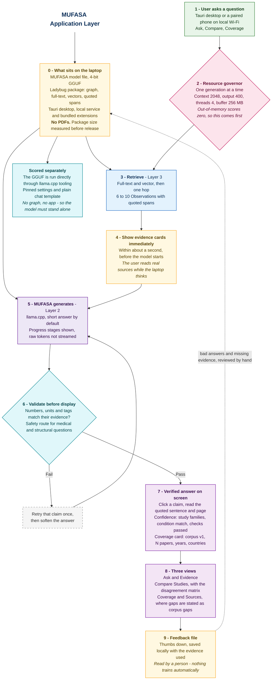

# The Application Layer

**Layer 4 of 4.** The program that runs on the laptop: it orchestrates retrieval, generation and validation, and shows the result.

> **All examples here are synthetic.** Paper identifiers are placeholders and no real DOI appears. Nothing goes into a report or a demo until it comes from a verified record.

Scope note: the first release uses a lightweight Tauri desktop shell, one local Python service and one shared web interface. It has no cloud dependency, user account or remote server.

## The application is the orchestrator

This is not a web page wrapped around a model. It is the component that owns the whole answer, and — more importantly on this hardware — owns the machine's resources.

It controls:

| Responsibility | Why it belongs here |
|---|---|
| Retrieval calls | It decides what to ask Layer 3 for, and with what budget |
| Context construction | It builds the prompt, and enforces its size |
| Generation | It runs llama.cpp with fixed limits |
| Validation | Nothing reaches the screen unchecked |
| Cancellation | The user can stop a slow answer and free the memory |
| Concurrency | **One generation at a time**, always |
| Resource limits | Context cap, output cap, thread cap, graph buffer cap |
| Feedback | Written locally, never sent anywhere |

Loopback by default, single user, one active generation. An explicit **Share on local Wi-Fi** switch may expose the same interface to a paired phone on the laptop's private network; inference and retrieval still remain on the laptop. This keeps peak memory predictable under a ceiling where going over scores zero.

## How the two halves are judged

The official evaluation runs the `.gguf` directly through `llama.cpp` tooling for model quality, throughput, memory and thermals. This application is not present in that direct model run.

But the challenge also requires a working on-device system with a load-bearing cross-disciplinary integration, and Gates 2 and 3 — a 30-minute technical Q&A and a live pitch — judge the whole thing. There is a Best Integration award as well.

So both statements are true at once:

- **MUFASA must be strong with no retrieval at all**, because that is what the profiler measures.
- **The graph and the application must be genuinely useful**, because people will interrogate them directly.

Packaging the model correctly — chat template, stop tokens, sensible defaults and reproducible direct `llama.cpp` settings — is a task in its own right. Do it in week one, not on the last day.

## What the user sees: three views

**1. Ask & Evidence.** Question, answer, evidence cards, confidence, limitations. Claims carry `[E1]`, `[E2]`; clicking one opens its card:

```text
"The 10% RHA mix achieved 31.2 MPa at 28 days."      (synthetic example)

Paper P-1024 · page 8, table 4 · Results
2 study families report this · conditions match your question
```

This one view covers the clever questions, because they are just questions — substitutes for an import, why studies disagree, what to try next. The retrieval layer decides how to handle each. No separate screen per question type.

**2. Compare Studies.** A table: one row per study family, columns for conditions, measurements and results, every cell clickable to its span. Underneath it, the **disagreement matrix** — supporting, conflicting and inconclusive observations grouped, with the conditions that differ between them named:

> Four observations, three agree. The outlier differs only in ash burning temperature.

This is the strongest cheap feature in the product. It is a query plus a grouping, and it is what a working researcher actually wants.

**3. Coverage & Sources.** What is in the corpus: version, paper count, disciplines, countries, date range, last updated — and which material-property combinations have no matching evidence in it.

Gaps live **here**, not in their own screen, and that placement is the point. A gap is a statement about your corpus, not about science. The panel makes that framing unavoidable.

## The coverage card

Beside every answer, and especially beside every "nothing found":

```text
MUFASA corpus v1 · 214 papers · materials engineering
2005–2024 · Nigeria, Ghana, Cameroon · built 12 Aug 2026
```

When there is no evidence, the answer reads:

> "No verified matching evidence in MUFASA corpus v1 (214 papers, materials engineering, 2005–2024). The nearest related evidence is [E3]."

Never "nobody has studied this." Absence in a 214-paper corpus is not absence in the literature, and a judge will ask.

## Confidence, shown plainly

Four short lines beside every answer:

- **Grounded / partly grounded / no matching evidence in corpus**
- **3 study families** — separate experiments, not paper count
- **Conditions match** — or which ones do not
- **All numbers checked** — or which failed

Two rules stop this becoming decoration: thin evidence must *look* different at a glance, and "not in this corpus" is a complete, respectable answer rather than an error state.

## Do not stream unverified text

The answer is validated before the user reads it, so raw token streaming cannot also be true. Instead, stay responsive by showing real progress:

```text
1. Searching…              evidence cards appear here, within about a second
2. Comparing studies…      the compare table fills in
3. Generating…             a stage indicator, not raw tokens
4. Checking citations…
5. Answer
```

The user is reading real sources during step 1, which is where trust is actually built, and the model's slowness is hidden behind something useful rather than a spinner. Then they see one verified answer, never a draft claim that gets retracted.

Keep answers short by default. Speed is 30% of the automated score and a rambling model is worse to use. Answer, cite, state what is uncertain, stop.

## Safety route

Medical, structural and industrial questions return an **evidence summary with limitations**, never an individual prescription. Show what studies found, under what conditions, and what was not tested. Add a line pointing to a qualified professional and local standards.

This costs one branch in the prompt logic and removes an entire category of risk.

## What it is built from

| Part | Choice | Why |
|---|---|---|
| Model | Direct `llama.cpp` runtime | The accepted GGUF follows the same runtime path used for profiling |
| Local service | FastAPI | Owns retrieval, generation, validation and single-flight resource limits |
| Desktop | Tauri using the operating-system webview | Lightweight installed product without an Electron runtime |
| Front end | One responsive web interface | Shared by Tauri and the optional phone client |
| Local Wi-Fi | Disabled by default; pairing code when enabled | A phone can use the laptop without cloud inference or internet access |
| Evidence card | A panel showing the quoted span and its citation | No PDF viewer, no PDFs. Instant |
| Storage | The Ladybug package from Layer 3. **No PDFs** | The app adds no data store of its own |

One launcher starts the local service and Tauri window. The service binds to `127.0.0.1` unless the user deliberately enables local sharing; Wi-Fi mode uses a short-lived pairing code and stops when sharing is switched off. The phone is only another interface—the model, graph and documents never move to it.

## The resource governor

Small, and it protects the only two failure modes that score zero.

```python
MAX_CONTEXT_TOKENS = 2048     # prompt reading dominates CPU latency
MAX_OUTPUT_TOKENS  = 400      # short answers, deliberately
LLAMA_THREADS      = 4        # leave headroom; full load overheats
LADYBUG_BUFFER_MB  = 256      # never accept the default
SINGLE_FLIGHT      = True     # one generation at a time, enforced
```

Plus a cancel button that actually frees the work, and a refusal to start a second generation while one is running. Out-of-memory is disqualification; thermal throttling costs 10 marks. Both are prevented here.

## Integrity manifest

Ship a file listing hashes for everything, and show the corpus version in the UI:

```text
mufasa.Q4_K_M.gguf     sha256:...
mufasa-graph/          sha256:...   corpus_v1, 214 papers
embedding-model/       sha256:...
prompts/system.txt     sha256:...
ladybug                version + wheel hash
extensions/            fts, vector — bundled, offline-verified
```

An hour of work. It makes the submission reproducible and auditable, and it answers the "how do we know this is what you tested?" question before it is asked.

## Feedback

A thumbs-down button and a text box, written to a local file with the question, answer and evidence used.

**Nothing enters training automatically.** You read the queue and decide. Bad answers become training examples, missing evidence becomes papers to acquire. An hour of work, and it gives a real answer when a judge asks how the system improves.

## Build order

About one week, after retrieval works. Gate 1 closes **25 August 2026**.

| Days | Step | Cut? |
|---|---|---|
| 1 | Package the model: chat template, defaults and direct `llama.cpp` profiler run | **Never — this is what is scored** |
| 1 | Resource governor and single-flight generation, measured with the profiler | **Never — this prevents a zero** |
| 1–2 | FastAPI service, responsive interface and staged progress display | No |
| 2–3 | Ask & Evidence with clickable spans | No — this is the demo |
| 3 | Tauri desktop shell, confidence lines and coverage card | No |
| 4 | Compare Studies table | No |
| 4–5 | Disagreement matrix | Keep — the standout feature |
| 5 | Coverage & Sources view | Keep |
| 5 | Safety route | Cheap, keep |
| 6 | Integrity manifest and feedback queue | Cheap, keep |
| 6–7 | One African language, tested end to end — aliases in, full answer out | Keep if the model handles it well |
| — | Store distribution, exports, multi-user and several languages | Not this month |

Also due for Gate 1: the public repo on the ADTC template, `REPORT.md` with **measured** numbers, screenshots, and the two-minute video.

## The demo

Disconnect the network. Ask a hard question in your flagship domain. Evidence cards appear in about a second. Click one and read the exact sentence, its page and its study family. Open Compare and show three studies agreeing and one disagreeing, with the differing condition named. Then ask something the corpus does not cover, and watch it say precisely that — corpus v1, 214 papers, this date range — instead of inventing an answer.

On a $400 laptop, from a folder that fits on a cheap USB stick, with the memory monitor visible in the corner.

## Diagram




## How to Read the Diagram

- **Green** is the person asking.
- **Blue** is work the application does.
- **Yellow** is what sits on disk, or what gets written back to it.
- **Pink** is the resource governor — and note where it sits, **before any work begins**. That ordering is what keeps peak memory under the ceiling.
- **Purple** is MUFASA generating.
- **Cyan** is validation, and the separate box for what the judges actually run.
- **Violet** is what appears on screen.
- **Grey dashed** is the repair path.
- The dashed arrow at the bottom is feedback: reviewed by hand, never fed to training automatically.

Two things worth reading twice. Step 4 comes **before** step 5 — evidence cards appear while the model is still starting, which is what makes a slow laptop feel responsive. And step 6 sits between generation and the screen, which is why raw tokens are never streamed.

The box on the right stands alone on purpose: the automated scoring runs the model file with none of this attached.
