# 🦁 MUFASA

### Models for Understanding the Frontiers of African Scientific Advancement

[](https://huggingface.co/DestinyOtto/mufasa-gemma3-1b-sft-gguf)
[](https://huggingface.co/datasets/DestinyOtto/mufasa-sft-mixed)
[](https://github.com/Otto-Destiny/mufasa)

**A small foundation model that knows what African science has already found — and can reason with you about what it hasn't.**

Ask most language models what has been studied about groundwater in the Cross River Basin, or which local materials have been tested as partial cement replacements in Nigeria, and you get plausible prose assembled from a global average. MUFASA answers from a corpus of **10,480 African research papers** it was actually trained on, names the study, and tells you when it doesn't know.

It runs offline, on a laptop, in about 800 MB.

---

## Table of contents

1. [What makes MUFASA different](#1-what-makes-mufasa-different)
2. [At a glance](#2-at-a-glance)
3. [The problem](#3-the-problem)
4. [System overview](#4-system-overview)
5. [Part I — Data engineering](#5-part-i--data-engineering)
6. [Part II — Building the training set](#6-part-ii--building-the-training-set)
7. [Part III — Model engineering](#7-part-iii--model-engineering)
8. [Results](#8-results)
9. [What it looks like in use](#9-what-it-looks-like-in-use)
10. [Running MUFASA](#10-running-mufasa)
11. [What we did not build, and why](#11-what-we-did-not-build-and-why)
12. [Repository map](#12-repository-map)
13. [Reproducing this](#13-reproducing-this)

---

## 1. What makes MUFASA different

### It is both closed-book and open-book

Most domain models are one or the other. A retrieval-augmented assistant has no knowledge of its own — take away the database and it is an empty shell. A fine-tuned model has knowledge but cannot cite, ground, or be corrected by a document you hand it.

MUFASA is trained on both behaviours, from the same corpus, in the same weights:

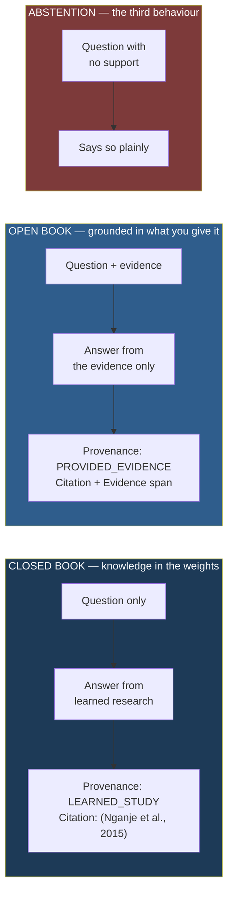

Every answer carries the same four-part contract, whichever mode it is in:

```
<answer>

Provenance: LEARNED_STUDY | PROVIDED_EVIDENCE | UNVERIFIED_STUDY | GENERAL_INFERENCE
Citation:   (Author et al., Year)
Study basis: discipline; design; population; location; period
```

That is not decoration. It is what makes a small model safe to use in research: you always know **whether it is recalling, reading, or inferring**, and you always have enough to go and check.

### It knows the African scientific landscape specifically

The corpus is not "science, filtered for Africa". Every paper passed a written relevance protocol in which **author affiliation explicitly does not count**:

> `affiliation_only` — The only African signal is authorship, institution, venue, or affiliation country → **exclude**
>
> Never infer geography from names, affiliations, journal, DOI, language, or model familiarity.

A Nigerian professor's paper on generic corrosion chemistry is excluded. A study of cassava peel ash as a cement extender in Ogun State is included. What the corpus captures is **research about African materials, populations, environments, and constraints** — which is precisely the knowledge a global model averages away.

### What that enables

- **Literature-gap reasoning** — it has read the adjacent work and can say what has and hasn't been tested
- **Local-alternative reasoning** — 1,801 of the sampled training pairs are tagged `INNOVATION`, covering local material substitutions, locally-sourced species and data, and constraint-driven engineering choices
- **Landscape awareness** — which institutions, regions and disciplines have produced what
- **Offline operation** — no internet, no API, no data leaving the machine

---

## 2. At a glance

| | |
|---|---|
| **Corpus** | 10,480 African research papers, 6 domains, 2000–2026 |
| **Extraction** | 10,131 papers processed → 8 structured tables |
| **Structured facts** | 479,143 QA pairs · 661,786 evidence spans · 265,833 observations |
| **Training set** | 378,005 supervised examples (353,697 train) — [on the Hub](https://huggingface.co/datasets/DestinyOtto/mufasa-sft-mixed) |
| **Base model** | `unsloth/gemma-3-1b-pt` (1.0 B parameters) |
| **Stage 1** | Continued pretraining — rsLoRA r=128, 99 M tokens |
| **Stage 2** | Full-parameter SFT — 310 M tokens/epoch |
| **Deployment** | GGUF Q4_K_M, ~800 MB, CPU-only, 7 GB RAM laptop — [on the Hub](https://huggingface.co/DestinyOtto/mufasa-gemma3-1b-sft-gguf) |
| **Dependencies at inference** | none — no retriever, no index, no network |

---

## 3. The problem

African research output is real, growing, and largely invisible to the models people actually use. It sits in journals that are poorly indexed, in PDFs that are badly scanned, behind licences that vary paper by paper. A researcher in Nsukka asking about local groundwater chemistry gets an answer shaped by the global literature — which is to say, mostly not about their problem.

Three consequences:

1. **Findings are re-derived** because nobody knew the study existed
2. **Local alternatives are overlooked** in favour of imported defaults
3. **The models get worse over time** as global corpora grow faster than African ones

MUFASA is a small, deliberate correction: take the literature that exists, structure it properly, and put it into a model small enough that anyone can run it.

---

## 4. System overview

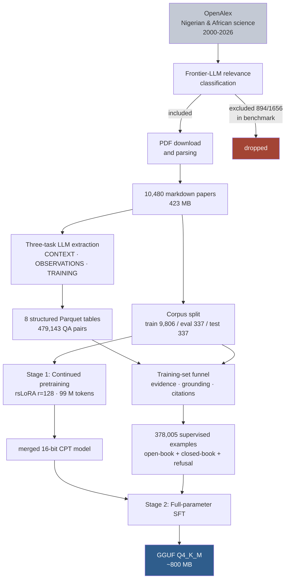

---

## 5. Part I — Data engineering

### 5.1 Sourcing and the relevance question

Papers were discovered through OpenAlex, filtered to African — predominantly Nigerian — science across 2000–2026. The hard question was not *finding* papers but deciding **what counts as African research**.

The naive filter is institution country. We rejected it, and wrote a protocol that says so explicitly. The classification runs on **title and abstract only** — authors, affiliations, DOI, journal and country codes are deliberately withheld from the prompt, so the model cannot cheat by recognising a Nigerian university.

Each paper receives a structured verdict:

| field | values |
|---|---|
| `evidence_level` | direct · inherent · latent · affiliation_only · absent · contradicted |
| `african_centrality` | 0–4 |
| `hard_exclusion_reason` | affiliation_only · explicit_non_african_scope · outside_scientific_scope · … |

On a 1,656-paper labelled benchmark:

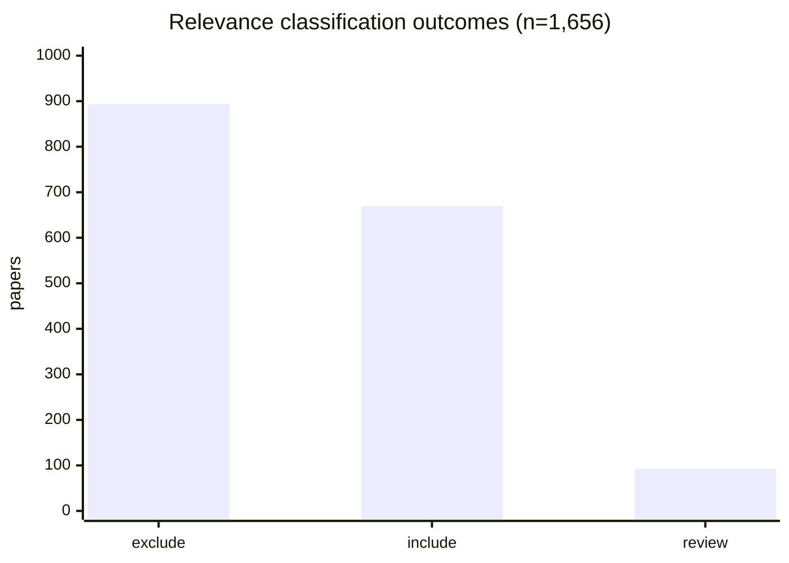

**54% of candidate papers were excluded.** The single most common reason was `affiliation_only` — African authorship with no African research content. That number is the cost of taking the definition seriously, and it is why the corpus is what it claims to be.

A useful property emerged: `african_centrality` is **strongly bimodal** — 725 papers at 0, 644 at 4, only 102 across the whole middle. The judgement is usually easy; the protocol's nuance is spent on a small minority.

### 5.2 Corpus composition

10,480 papers survived classification, download and parsing.

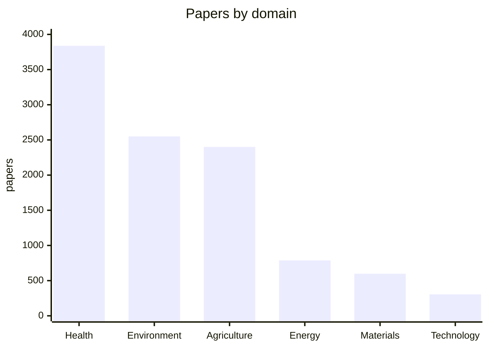

| domain | papers | share |
|---|---:|---:|
| Health (HLT) | 3,838 | 36.6% |
| Environment (ENV) | 2,550 | 24.3% |
| Agriculture (AGR) | 2,401 | 22.9% |
| Energy (ENR) | 787 | 7.5% |
| Materials (MAT) | 599 | 5.7% |
| Technology (TEC) | 305 | 2.9% |
| **total** | **10,480** | |

Every paper carries provenance in its front matter — OpenAlex ID, DOI, licence, PDF hash, parser used, and a `family_id` marking near-duplicate studies from the same group.

### 5.3 Extraction

Each paper went through a three-task extraction producing eight linked tables.

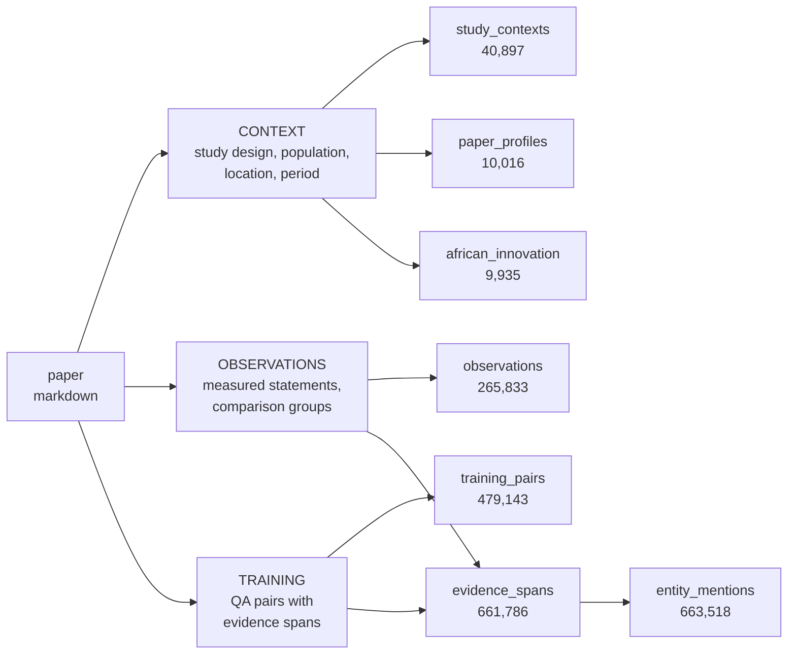

| table | rows | what it holds |
|---|---:|---|
| `entity_mentions` | 663,518 | named entities linked to evidence |
| `evidence_spans` | 661,786 | verbatim quotes with character offsets |
| `training_pairs` | 479,143 | question / answer / reasoning |
| `observations` | 265,833 | measured statements with comparison groups |
| `study_contexts` | 40,897 | design, population, period, location |
| `extraction_status` | 10,131 | per-paper audit |
| `paper_profiles` | 10,016 | discipline, contribution, science checks |
| `african_innovation` | 9,935 | local materials, substitutions, constraints |

**Every claim is anchored.** An answer is only usable if it points at a character span in the source document — which is what makes the grounding checks in §6 possible at all.

### 5.4 Engineering decisions worth naming

**Resilience over strictness.** Extraction ran through five gateways across thousands of papers. A single malformed JSON response should never cost a paper, so the pipeline salvages truncated output, mends stray quotes, retries while keeping the fullest attempt, and isolates failures per record.

**JSON is the authority, Parquet is a cache.** The tables are derived artifacts and were rebuilt from raw JSON when a writer bug was found. A staleness check compares JSON file count against table rows.

**Schema drift is measured, not assumed.** 393 papers marked complete produced no training pairs. Inspection found 123 with content under drifted keys (`examples`, `qa_pairs`, `reasoning_examples`) — **3,879 recoverable pairs, 0.81% of the corpus**. The other 270 held no payload at all. Quantified, then deliberately deferred.

**Author-year citations are resolved against the document, not just metadata.** OpenAlex supplies a candidate; the paper's own first page is then scanned for publication-year and first-author signals. Where they disagree, **the document wins**:

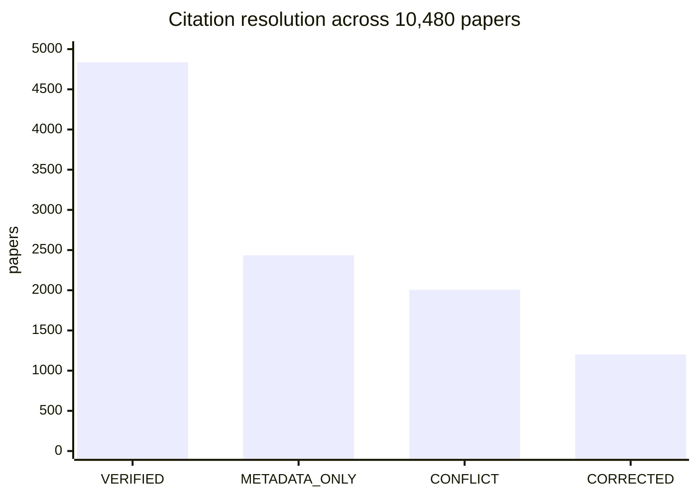

**57% were confirmed or corrected against the paper itself.** `CONFLICT` means the document offered two contradictory years at equal confidence, not that it disagreed with OpenAlex.

---

## 6. Part II — Building the training set

### 6.1 The funnel

Raw extraction is not training data. Everything passes a staged funnel, and every stage reports what it removed and why.

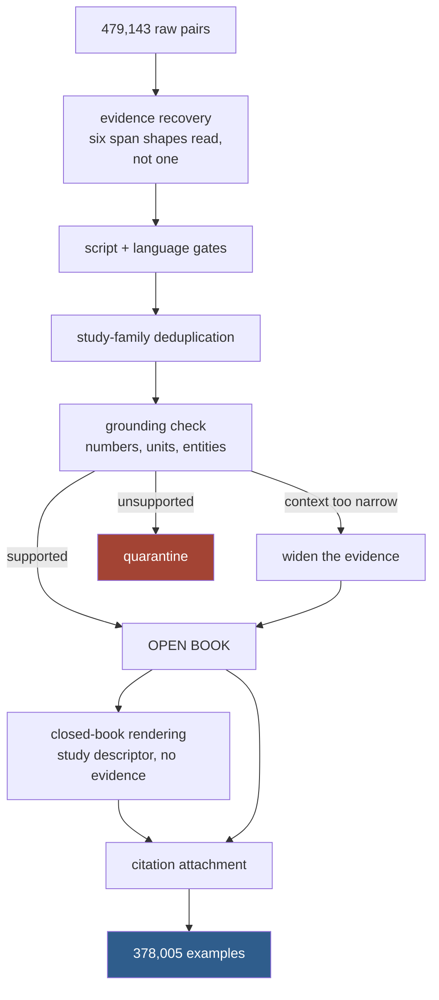

Reading evidence in **six shapes instead of one** raised coverage from 73% to 92% — recovering 88,242 pairs that were present but unread.

### 6.2 Open-book and closed-book from the same fact

The distinction is in what the prompt withholds:

| | open book | closed book |
|---|---|---|
| prompt contains | evidence quotes + question | study descriptor + question |
| model must | read and ground | recall from weights |
| provenance emitted | `PROVIDED_EVIDENCE` | `LEARNED_STUDY` |
| failure mode trained | say the evidence doesn't cover it | say it doesn't know |

The same extracted fact generates both. That is deliberate: a model that has only seen grounded answering never learns to recall, and one that has only recalled never learns to defer to a document.

> The full supervised set is published at
> **[DestinyOtto/mufasa-sft-mixed](https://huggingface.co/datasets/DestinyOtto/mufasa-sft-mixed)**
> — 378,005 examples with their evidence spans, citations and verification tiers.

### 6.3 What the examples cover

Tag distribution across a 20,000-example sample:

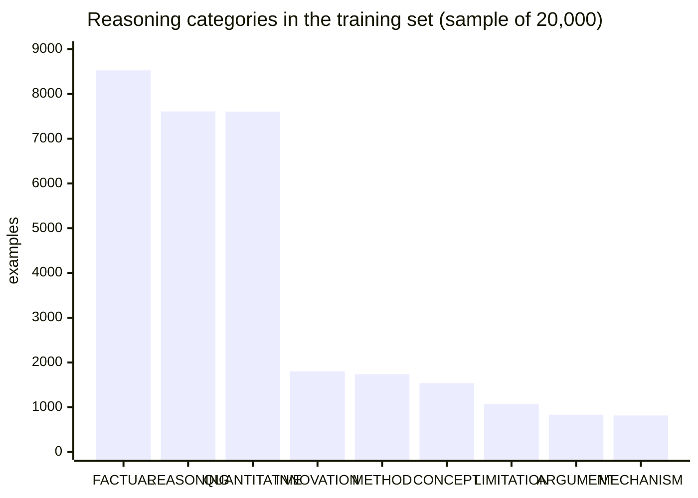

`INNOVATION` at 1,801 is the category that carries local-alternative reasoning — substituted materials, locally-sourced species, constraint-driven engineering.

### 6.4 Splitting — done once, read everywhere

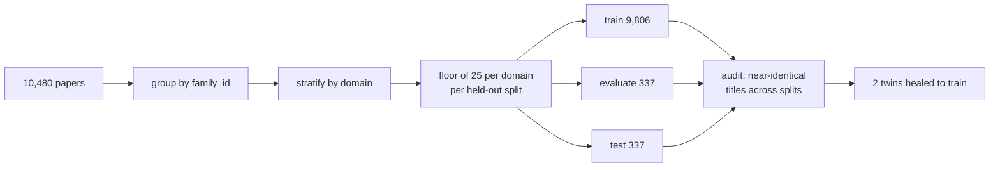

Two design choices worth stating:

**A flat percentage keeps shares right but not counts.** Technology is 2.9% of the corpus, so 3% of it is nine papers — enough for a pooled number, far too few to say anything about technology. A **floor of 25 per domain per split** costs 52 training papers and makes every domain individually scoreable.

**The audit found two near-duplicate titles across splits** — the same groups reporting adjacent work — and moved both to train rather than dropping them.

---

## 7. Part III — Model engineering

### 7.1 Why two stages

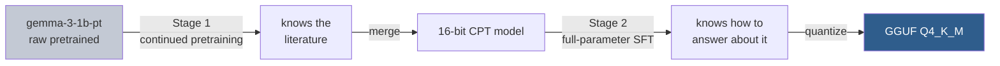

CPT puts the **facts and the vocabulary** into the weights. SFT teaches the **contract** — question answering, provenance, citation, abstention. Starting from `-pt` rather than `-it` means Stage 2 is doing the instruction tuning itself, not layering a domain on top of someone else's.

### 7.2 Stage 1 — Continued pretraining

| setting | value | why |
|---|---|---|
| base | `unsloth/gemma-3-1b-pt` | pretrained, not instruction-tuned |
| method | rsLoRA, r=128, α=32 | rank-stabilised scaling (α/√r) |
| targets | q,k,v,o + gate,up,down + `embed_tokens`, `lm_head` | 182 LoRA modules across 26 layers, plus 2 full wrappers |
| window | 4,096 tokens | measured p99 of the corpus |
| corpus | train split only, ~99 M tokens | evaluate/test never seen |

**Text preparation mattered as much as hyperparameters.** Papers average ~10,000 tokens, and TRL truncates rather than windows — measured, that would have discarded **28% of the corpus and the tails of 59% of papers**, which is where discussion and conclusions live. Explicit tokenizer-aware windowing was added, with EOS on the final window of a paper only.

References were stripped: roughly 22% of a paper, almost entirely author names and years, and training on it teaches citation-shaped text with no way to be right.

Validation loss over the run:

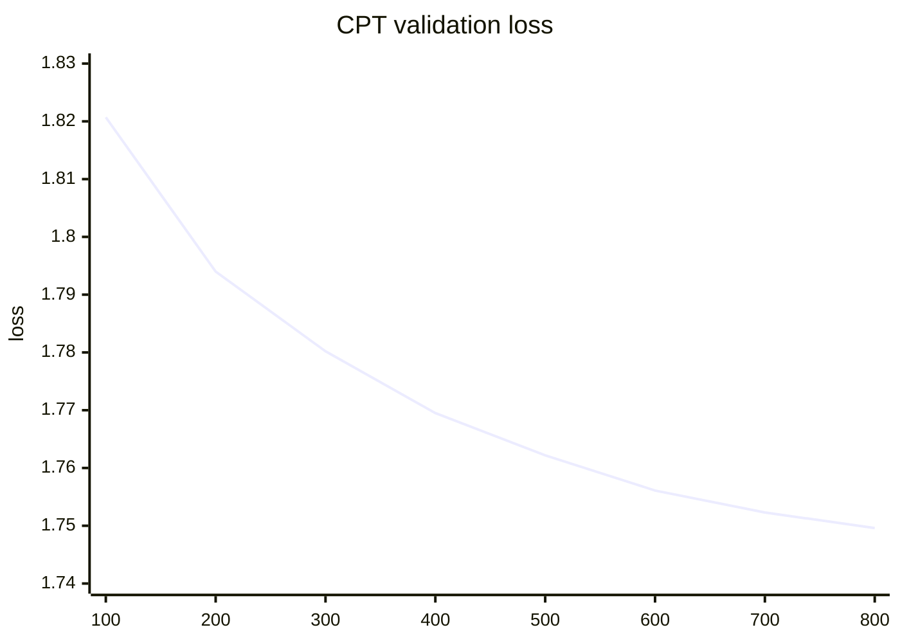

Monotonic, no overfitting, converging by step 855.

### 7.3 Stage 2 — Full-parameter SFT

Full fine-tuning, not LoRA. The reasoning: at 1 B parameters the memory argument for LoRA disappears (~10 GB of state), the CPT stage was already low-rank so a second low-rank pass compounds that limitation, and **this stage is doing instruction tuning from a raw pretrained base** — a large behavioural change, which is what full updates are for.

| setting | value |
|---|---|
| trainable | 999,885,952 / 999,885,952 (100%) |
| examples | 353,697 train, 12,374 held out |
| tokens/epoch | 310 M (mean 876/example, measured) |
| effective batch | 64 sequences |
| learning rate | 2e-5, cosine, 3% warmup |
| masking | prompt masked, loss on the answer only |

---

## 8. Results

### 8.1 CPT — did the model learn the literature?

Measured on held-out papers the model never saw:

| metric | value | reading |
|---|---:|---|
| domain perplexity | **5.94** | on African research writing |
| domain bits/byte | **0.7326** | tokenizer-independent |
| general perplexity | 11.56 | ordinary English |
| general bits/byte | 0.8064 | |
| span NLL (trained papers) | 4.8879 | retention |
| span NLL (held out) | 4.7255 | generalisation |

Domain perplexity is roughly **half** the general figure — the model finds African research writing substantially more predictable than ordinary English, which is the point of the exercise.

### 8.2 The African concept recall probe

A purpose-built probe: 400 cloze items over local concepts — `Xylopia aethiopica`, bambara groundnut, garri, bitter leaf, `Irvingia gabonensis`, African yam bean — measuring whether the model predicts them better in context after CPT.

| | trained papers | held-out papers |
|---|---:|---:|
| items / papers / distinct concepts | 200 / 137 / 89 | 200 / 129 / 92 |
| base span perplexity | 19.30 | 20.78 |
| **CPT span perplexity** | **12.84** | **14.78** |
| improvement | **−33%** | **−29%** |
| conditional win rate | 0.670 | 0.655 |
| first-token recall@5 (base → CPT) | 0.48 → 0.555 | 0.50 → 0.510 |

```mermaid
xychart-beta
    title "African concept span perplexity — lower is better"
    x-axis ["trained papers", "held-out papers"]
    y-axis "span perplexity" 0 --> 24
    bar [19.30, 20.78]
    bar [12.84, 14.78]
```

*(grey = base Gemma 3 1B, blue = after CPT)*

**CPT wins on two thirds of individual concepts**, and the improvement transfers to papers it never read — 29% on held-out, against 33% on trained. That gap is small, which is the encouraging part: this is domain learning, not memorisation.

### 8.3 An honest negative result

The probe also measures **association gain** — improvement on the true paper context minus improvement on a neutral context. If CPT taught genuine paper-specific association, this would be positive. It is not:

| | trained | held out |
|---|---:|---:|
| mean raw NLL gain | +0.4077 | +0.3408 |
| mean neutral NLL gain | +0.6879 | +0.6681 |
| **mean association gain** | **−0.2802** | **−0.3273** |
| 95% CI | [−0.391, −0.070] | [−0.463, −0.089] |

The model got better at these concepts **generally** — a stronger African-vocabulary prior — more than it learned which paper said what. The confidence intervals exclude zero, so this is a real effect, not noise.

We report it because it is the honest read of our own instrument, and it sets the agenda: rank, embedding-path coverage, and full-parameter CPT are the levers, and the SFT stage is where paper-specific association is most likely to be established.

### 8.4 SFT — and where we stopped

The full-parameter SFT run was halted deliberately at step ~1,547 of 5,527, because the held-out curve told us to:

| step | training loss | validation loss | |
|---:|---:|---:|---|
| 250 | 0.7467 | 0.6037 | |
| 500 | 0.7279 | 0.5951 | |
| 750 | 0.7179 | 0.5951 | |
| **1000** | 0.7107 | **0.5930** | ← best |
| 1250 | 0.6850 | 0.6000 | rising |
| 1500 | 0.6537 | 0.6119 | rising |

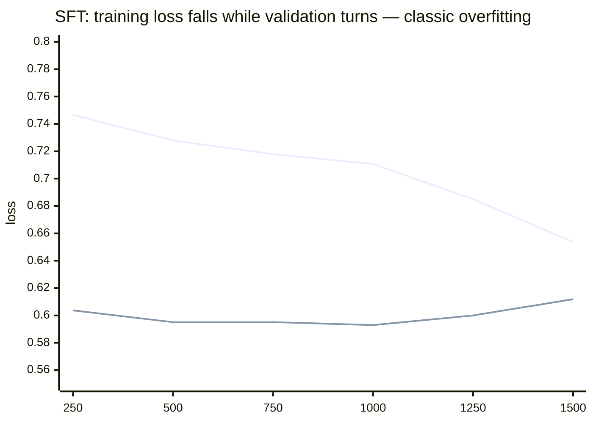

**The model converged at 18% of one epoch.** Training loss kept falling while validation turned upward — the textbook signature. The best checkpoint is step 1,000, and running to the end of the epoch would have produced a worse model at five times the cost.

This is the kind of finding that only appears if you wire held-out evaluation in from the start.

---

## 9. What it looks like in use

### Closed book — recall, with a citation

> **Q.** *In the Ogun State rice-growing communities study, how often were respondents incapacitated by infection?*
>
> **A.** 45% of respondents were incapacitated 1–2 times, 27% 3–4 times and 19% were incapacitated more than 4 times.
>
> `Provenance: LEARNED_STUDY`
> `Citation: (Sam-Wobo et al., 2013)`
> `Study basis: discipline: PARASITOLOGY; population: consented volunteers (adults and school-age children) resident in the communities; period: May 2009 to March 2010`

No evidence was supplied. The figures came from the weights, and the study is named precisely enough to verify.

### Closed book — reasoning, with the inference marked

> **Q.** *What did the modified Gibbs diagram indicate about water composition in the Cross River Basin?*
>
> **A.** A plot on a modified Gibbs diagram places most of the water samples in the region of rock dominance, indicating rock weathering as a primary factor controlling the water composition.
>
> **Answer:** The modified Gibbs plot places most samples in rock dominance, which the authors interpret as evidence for primary control by rock weathering.
>
> `Provenance: LEARNED_STUDY`
> `Citation: (Nganje et al., 2015)`
> `Study basis: discipline: HYDROLOGY_HYDROGEOLOGY; design: detailed geochemical study; population: surface water and groundwater sources; location: southeastern Nigeria; period: July–August 2009`

Note the separation: the reasoning is stated, then the answer, then what the *authors* concluded — the model distinguishes reported finding from its own inference.

### Open book — with hedging when attribution is uncertain

> `Provenance: UNVERIFIED_STUDY`
> `Citation: (Sam-Wobo et al., 2013) [unverified]`

The `[unverified]` marker is trained behaviour, not a post-hoc filter. The model learned to hedge when the attribution chain is weaker.

### Where a general model gives you nothing useful

Questions MUFASA is built for and a general 1 B model is not:

- *Which locally-available materials have been tested as partial cement replacements in Nigerian construction?*
- *What has been measured about helminth infection and agricultural labour productivity in southwest Nigeria?*
- *Has anyone characterised the hydrochemistry of shale bedrock aquifers in the Niger Delta?*
- *What gaps remain in African yam bean nutritional studies?*

---

## 10. Running MUFASA

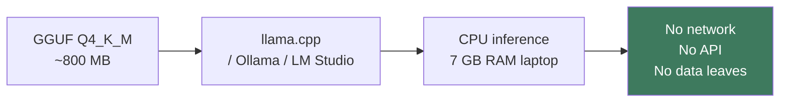

| requirement | |
|---|---|
| RAM | 7 GB (model ~800 MB + context) |
| GPU | not required |
| network | not required at any point |
| runtime | llama.cpp, Ollama, LM Studio |

### Build and run

Install or build [`llama.cpp`](https://github.com/ggml-org/llama.cpp), then download the Q4_K_M GGUF from the Hugging Face repository.

### Build llama.cpp

```bash
git clone https://github.com/ggml-org/llama.cpp
cd llama.cpp

cmake -B build
cmake --build build --config Release -j
```

### Run MUFASA

```bash
./build/bin/llama-cli \
  -m /path/to/MUFASA-Gemma3-1B-SFT-Q4_K_M.gguf \
  -p "Explain how vegetation loss can reinforce drought conditions in the Sahel."
```

Once the model weights are downloaded, no cloud inference API is required.

---


This matters more than a benchmark number. A researcher on intermittent connectivity, on institutional hardware, working with unpublished data they cannot send to an API — this runs on their laptop, in a field station, on a plane.

---

## 11. What we did not build, and why

**A knowledge graph and retrieval layer.** Designed, documented in [`03-retrieval/`](03-retrieval/), and deliberately not built. The challenge is a data-and-model-engineering competition, and the evaluation is of a raw GGUF answering prompts with no retriever attached. Given finite time we put it into the corpus, the extraction quality and the training data — the parts that determine what the *model itself* knows.

The architecture is worth reading as a statement of where this goes next: entity canonicalisation, licence-tiered retrieval, and a graph over the 663,518 entity mentions already extracted.

**The `african_innovation` question family.** The table exists with 9,935 rows and `INNOVATION` tags appear on 1,801 sampled examples, but a dedicated question family targeting local-material substitution was scoped and not implemented.

**Full-epoch SFT.** Stopped at 18% because the validation curve turned. That is a result, not an omission.

---

## 12. Repository map

```
01-data-engineering/
  african-relevance-classification-protocol.md   the definition of "African research"
  catalogs/                                      domain source catalogues
  data-extraction/
    mufasa_extract.py          extraction backend, provider abstraction, JSON salvage
    mufasa_dataset.py          the training-set funnel
    mufasa_training_builder.py immutable generation writer
    mufasa_citations.py        author-year resolution against the document
    mufasa_semantic.py         embedding retrieval for quarantined pairs
    mufasa_split.py            family-level, domain-stratified partitioning
    *.ipynb                    pipeline notebooks with outputs

02-model-engineering/
  cpt-notebooks/     continued pretraining, incl. the completed Gemma 3 1B run
  sft-notebooks/     supervised fine-tuning
  vast/              multi-GPU training script, Hub-to-Hub

03-retrieval/        the retrieval architecture we designed but did not build
slides/             briefing deck and infographics
```

---

## 13. Reproducing this

```bash
# 1. corpus split — once, read by every later stage
jupyter notebook 01-data-engineering/data-extraction/split-corpus.ipynb

# 2. citation metadata
jupyter notebook 01-data-engineering/data-extraction/prepare-citation-metadata.ipynb

# 3. training set
jupyter notebook 01-data-engineering/data-extraction/build-training-set.ipynb

# 4. continued pretraining
jupyter notebook 02-model-engineering/cpt-notebooks/mufasa_cpt_gemma3_1b.ipynb

# 5. supervised fine-tuning — notebook, or multi-GPU:
torchrun --standalone --nproc_per_node 8 02-model-engineering/vast/train_sft.py \
    --base USER/mufasa-gemma3-1b-cpt --data USER/mufasa-sft-mixed \
    --output USER/mufasa-gemma3-1b-sft --epochs 0.25
```

The heavy artifacts — the paper corpus, the Parquet tables, model weights — are not in this repository. The code that produces them is.

---

---

# 🦁 What MUFASA Stands For

| Letter | Meaning |
|---|---|
| **M** | Models |
| **U** | Understanding |
| **F** | Frontiers |
| **A** | African |
| **S** | Scientific |
| **A** | Advancement |

**MUFASA = Models for Understanding the Frontiers of African Scientific Advancement**

---

# 🌍 Vision

MUFASA is ultimately about making capable scientific AI more accessible.

Instead of assuming:

```text
Large GPUs + Cloud APIs + Constant Connectivity
```

we are exploring:

```text
Compact Models
+ Domain Adaptation
+ Local Evidence
+ Efficient CPU Inference
```

The goal is a scientific AI system that is:

> **small enough to run locally, specialized enough to be useful, grounded enough to inspect, and efficient enough to work on hardware people actually have.**

---

---

## 🔗 Links

- 🤗 **MUFASA GGUF:** [huggingface.co/DestinyOtto/mufasa-gemma3-1b-sft-gguf](https://huggingface.co/DestinyOtto/mufasa-gemma3-1b-sft-gguf)
- 🗂️ **MUFASA SFT dataset:** [huggingface.co/datasets/DestinyOtto/mufasa-sft-mixed](https://huggingface.co/datasets/DestinyOtto/mufasa-sft-mixed)
- 🦁 **Devpost:** [devpost.com/software/mufasa](https://devpost.com/software/mufasa)
- 🏆 **Africa Deep Tech Challenge 2026:** [adtc-2026.devpost.com](https://adtc-2026.devpost.com/)
- 💻 **Repository:** [github.com/Otto-Destiny/mufasa](https://github.com/Otto-Destiny/mufasa)

---

---

## 📄 License

Repository code and documentation are released under the **Apache License 2.0**.

See [`LICENSE`](LICENSE) and [`NOTICE`](NOTICE) for details.

---

<div align="center">

**MUFASA** · African Deep Tech Challenge 2026

*Science that already happened, in a model small enough to carry.*

</div>
