# MUFASA

**Models for Understanding the Frontiers of African Scientific Advancement**

MUFASA is an offline African scientific-reasoning project being developed for constrained, affordable hardware. It combines a compact language model with evidence-grounded retrieval so that scientific answers can remain useful, inspectable and locally relevant without depending on cloud inference.

## Four layers

- **01.** [Data engineering](./01-data-engineering/) discovers, classifies and prepares African scientific evidence.
- **02.** [Model engineering](./02-model-engineering/) builds, evaluates and packages the compact MUFASA model.
- **03.** [Retrieval](./03-retrieval/) turns verified evidence into an offline GraphRAG package.
- **04.** [Application](./04-application/) provides the primary Tauri desktop app and a complete, compute-thin mobile web app over local Wi-Fi; inference and retrieval remain on the laptop.

The complete system design is described in [system-architecture.md](./system-architecture.md).

Historical discussions and exploratory decisions are preserved in [conversations.md](./conversations.md); reviewed layer documents take precedence where they differ.

## Current status

Data discovery and African-relevance classification are active. Model training, retrieval and application documents currently define the implementation contracts and release gates; their production code will be added as each layer is built and measured.

Large corpora, PDFs, generated partitions, model weights and runtime databases are deliberately kept out of Git. Public releases will use reproducible download/build scripts, manifests and checksums.

## Contributing

Changes are proposed from a prefixed branch and reviewed through a pull request; `main` is never a working branch. See [CONTRIBUTING.md](./CONTRIBUTING.md).
