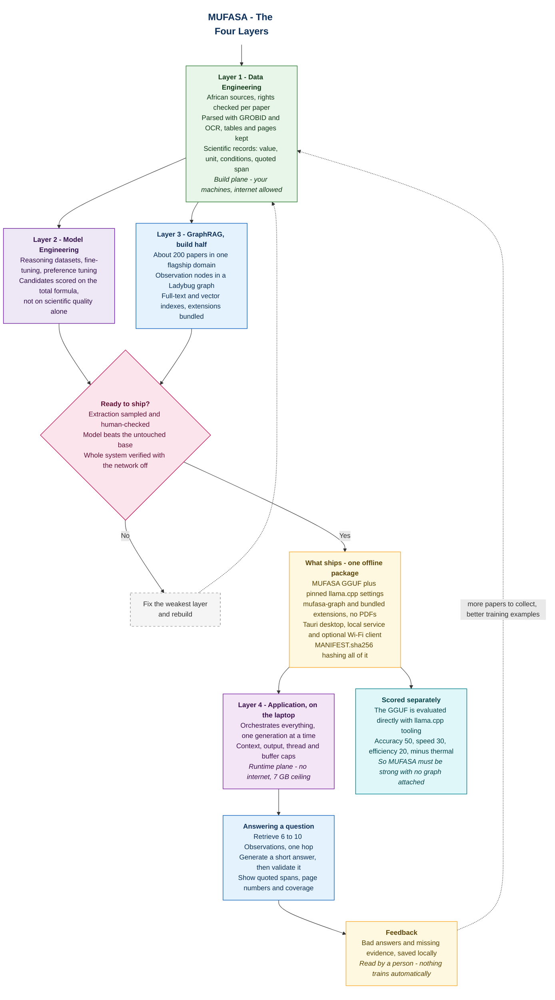

# MUFASA System Architecture

**Models for Understanding the Frontiers of African Scientific Advancement.**

The bird's-eye view: four layers, two planes, and what actually ships.

| Layer | What it does | Detail |
|---|---|---|
| **1 — Data** | Find African papers, check rights, parse them, extract scientific records | [data-engineering](./data-engineering/) |
| **2 — Model** | Train MUFASA to reason about African science | [model-training-pipeline.md](./model-engineering/model-training-pipeline.md) |
| **3 — Retrieval** | Turn records into an evidence graph and query it offline | [retrieval-architecture.md](./retrieval/retrieval-architecture.md) |
| **4 — Application** | Orchestrate, validate and show the answer on a cheap laptop | [application-architecture.md](./application/application-architecture.md) |

## Two planes

The clearest way to hold the whole system in your head is not four layers stacked, but **two planes**: what you build beforehand, and what runs on the judge's laptop.

```text
BUILD PLANE — your machines, hours or days, internet allowed
──────────────────────────────────────────────────────────────
  African sources
      → rights, parsing, scientific records
          ├─→ training datasets  → fine-tuning → validated GGUF
          └─→ evidence graph + indexes → versioned retrieval package

RUNTIME PLANE — one laptop, milliseconds, no internet, 7 GB ceiling
──────────────────────────────────────────────────────────────
  Question → orchestrator → retrieve → generate → validate → answer
```

Layer 1 is entirely build plane. Layer 2 is build plane, producing one file. Layer 3 spans both — it builds a package beforehand and queries it at runtime. Layer 4 is entirely runtime.

Anything that needs the network, a frontier model, or more than a few hundred megabytes belongs above the line. That single test resolves most design arguments.

## What each layer hands on

| From → To | What crosses | The rule it must keep |
|---|---|---|
| 1 → 2 | Training datasets: reasoning data, preference pairs, frozen benchmark | Splits leak-safe; one experiment never spans train and test |
| 1 → 3 | Scientific records: observations, conditions, units, quoted spans, rights | Nothing without a page and a source |
| 2 → 4 | The GGUF, its chat template and decoding defaults | Pinned and hashed; identical to what the judges run |
| 3 → 4 | 6–10 evidence records per question, with spans | Small enough that a CPU can read it quickly |
| 4 → 1, 2 | Feedback: bad answers, missing evidence | Read by a human; **nothing trains automatically** |

## The competition envelope

| Constraint | Value |
|---|---|
| Machine | Intel i5 10th–12th gen or Ryzen 5, integrated graphics, 8 GB DDR4, Ubuntu 22.04 |
| Memory | **7 GB ceiling. Exceeding it, or crashing, scores zero** |
| Runtime | **llama.cpp with GGUF only** |
| Network | **None during evaluation** |
| Score | `0.50 × accuracy + 0.30 × speed + 0.20 × efficiency − thermal penalty` |
| Efficiency | `100 × (7 GB − peak RAM) / 7 GB` |
| Thermal | −10 above 85 °C or on throttling |
| Required | A working on-device system with one load-bearing cross-disciplinary integration |
| Gate 1 | **25 August 2026** |

**How the two halves are judged.** The automated profiler runs your `.gguf` alone — no graph, no application. So MUFASA must be strong on its own. But Gate 2 is a 30-minute technical Q&A and Gate 3 is a live pitch, and there is a Best Integration award, so the graph and the app are examined directly. Neither half is optional; they are simply judged differently.

Declare it plainly in the submission:

```text
Primary track:  Math & Scientific Reasoning
Integration:    Offline GraphRAG over African materials-engineering evidence
```

## What the scoring implies about model size

The formula is explicit enough to calculate. Taking decode speed as roughly memory-bandwidth-bound on integrated graphics, at Q4:

| Build | Peak RAM | Est. tokens/sec | Speed + efficiency, of 50 |
|---|---|---|---|
| 8B | ~5.2 GB | ~2.5 | **~10** |
| 4B | ~3.1 GB | ~6 | **~23** |
| 1.7B | ~1.7 GB | ~13 | **~41** |

Accuracy carries half the weight, so a 4B build must score roughly **36 accuracy points higher** than a 1.7B, on a 0–100 scale, merely to break even. Judge scores compress; that gap is not realistic.

**These are estimates from public hardware characteristics, not measurements.** They are here to shape the candidate list before you freeze a base model — add 1–2 B reasoning candidates to the benchmark and score every candidate on the total formula, not on scientific quality alone. Replace all of these numbers with ADTC profiler runs before any of them appear in `REPORT.md`.

## Scope for Gate 1

The data work has classified metadata; PDFs are not downloaded yet. The plan reflects that.

| | Gate 1 | Later |
|---|---|---|
| Training corpus | The wider classified set | Grows |
| **Retrieval graph** | **~200 rights-cleared, well-parsed papers in one flagship domain** | More domains |
| Languages | One African language, tested end to end | More |
| Graph queries | One hop, occasionally two | Deeper |
| Coverage claims | Scoped to the corpus, always | Unchanged — this is permanent |

200 well-parsed papers answering three questions perfectly beats 6,000 badly parsed ones answering vaguely. The graph must be load-bearing, and it cannot be load-bearing if the extraction underneath it is thin.

**Deferred deliberately:** community summaries, automatic novelty claims, automatic detection of duplicate experiments across publications, deep traversal, learned rerankers, multiple languages, speculative queries while the user types.

## What ships

```text
model/mufasa.gguf      model fetched by the credential-free download script
runtime/               pinned llama.cpp launch settings and chat template
mufasa-graph/          Ladybug package: graph, full-text, vectors,
                       and the quoted span behind every claim
extensions/            Ladybug fts and vector binaries, bundled for offline use
application/           Tauri desktop, local service and optional Wi-Fi web client
MANIFEST.sha256        hashes for all of the above, plus corpus version
```

**No PDFs.** Every claim carries its sentence, page and study family — a couple of megabytes for 200 papers, against 300 MB of documents. It shows instantly, and it avoids redistributing papers you may not have the right to redistribute.

The bundled `extensions/` folder is not optional. Ladybug downloads its full-text and vector extensions over the network on first use; on an offline machine that fails. Install once with internet, bundle the binaries, then verify with networking disabled.

## How each layer is checked

| Layer | Gate | Measured by |
|---|---|---|
| 1 — Data | Nothing ships without a source and a rights record | Parse success rate, extraction accuracy on a checked sample |
| 2 — Model | Beats the untouched base without regressions | Frozen benchmark, plus profiler: tokens/sec, peak RAM, thermals |
| 3 — Retrieval | 30–50 frozen questions | Recall@10, citation precision, unsupported-claim rate, corpus-scoped abstention, p95 latency |
| 4 — Application | Works offline, stays under the ceiling | Peak RSS, cold start, cancel works, network-off run |

Measure each separately. A single end-to-end number cannot tell you which layer to fix.

## Diagram




## How to Read the Diagram

- **Green** is source material — the papers and the records made from them.
- **Purple** is model training.
- **Blue** is building or querying the graph.
- **Yellow** is what ships, and what comes back as feedback.
- **Pink** is the gate that decides whether the release is ready.
- **Cyan** is the separately scored path.
- **Violet** is the application on the laptop.
- **Grey dashed** is rework.

Layers 2 and 3 both branch from Layer 1, because the training datasets and the evidence graph are two products of the same parsing work. They rejoin at the release gate.

Everything above the release gate is the **build plane** — your machines, internet allowed, run once. Everything below it is the **runtime plane** — one laptop, no network, 7 GB ceiling. That line is the most useful boundary in the whole system: if a design needs the network, a frontier model, or serious memory, it belongs above it.

The feedback arrow deliberately routes back to Layer 1 rather than into training directly. A person reads it first.
